::: {.callout-important}
## هشدار — مدل کالیبره‌نشده و گزارش در حال تکمیل
این گزارش نسخهٔ **فاز ۴** است. هندسهٔ شبکه از OSM با اصلاحات مبتنی بر تصویر
اصلاح شده (خط عرشه، نوع تقاطع‌های ادغام، ساختار پایه‌های پل) اما تقاضای پایه
همچنان **فرضی** (قضاوت مهندسی، نه شمارش میدانی) است. طبق قاعدهٔ سخت ۵ پروژه،
هر عدد گزارش‌شده **میانگین ± فاصلهٔ اطمینان ۹۵٪ روی ۱۰ seed مستقل** است. **هر
شش سناریوی برنامه‌ریزی‌شده (S0 تا S5) اکنون ساخته و شبیه‌سازی شده‌اند** —
S0 (وضع موجود)، S1 (چراغ‌دار، دو حالت)، S2 (حذف گردش چپ + دوربرگردان فیزیکی
میانهٔ عرشه، سه فاصلهٔ حساسیت)، S3 (میدان نامتقارن، دو گزینه)، S4
(کانالیزاسیون) و S5 (ترکیبی/خلاقانه، سه گزینه: متردهنده + سه طرح کنترل
بای‌پس: بدون‌قیدوشرط، یالدهنده، چراغ راهنمایی واقعی) — به‌علاوهٔ یک
**سناریوی ترکیبی تازه (S2+S4)** — مجموعاً **۱۴ نسخهٔ کنترلی، ۷۰۰ اجرای
SUMO رسمی** (۵λ×۱۰seed هرکدام). یک **آزمون تشخیصی جداگانه** (۱۰۰ اجرای
دیگر، خارج از رجیستری رسمی) نیز اجرا شد: تکرار S0/S1 با پارامترهای رفتاری
پیش‌فرض SUMO (نه تنظیمات تهاجمی این مطالعه) تا سهم «اثر خودِ چراغ» از سهم
«رفتار تهاجمی کالیبره‌نشده» جدا شود (بخش ۶).
بنابراین **این نسخه، اولین رتبه‌بندی کامل (نه لزوماً نهایی) فاز ۴ است** —
هنوز مشروط به کالیبراسیون واقعی (بخش ۱۰)، نه نتیجهٔ قطعی پروژه. اعداد این
گزارش فقط برای **مقایسهٔ نسبی سناریوها** معتبرند، نه پیش‌بینی مقادیر مطلق
دنیای واقعی. **فازبندی S1 با یک روش طراحی مهندسی واقعی بازسازی شد**
(`src/10_signal_design.py`: سبز وزن‌دار طبق وبستر + بازهٔ همه‌قرمز واقعی
از هندسهٔ هر گره، نه هیوریستیک خام netconvert) و **گرهٔ تعارض بای‌پس S5 با
یک چراغ راهنمایی واقعی طراحی‌شده با همین روش آزموده شد** — سومین و آخرین
تلاش هم‌سطح برای آن گره، پس از دو تلاش قبلی (شعاع تقاطع، سپس تنظیم
حق‌تقدم). **نتیجهٔ صادقانهٔ هر سه:** بازطراحی فازبندی S1 داستان اصلی را
تغییر نداد (رجوع به بخش ۷، مکانیزم ۵)، و چراغ راهنمایی واقعی روی گرهٔ
بای‌پس S5 نه‌تنها بهتر نبود، بلکه **بدترین** نتیجهٔ کل این مطالعه شد
(λ=۱.۴: ۳۲۵۷.۶ برخورد در هر اجرا). در مقابل، **سناریوی ترکیبی S2+S4**
همچنان بهترین نتیجهٔ ایمنی کل این مطالعه را دارد (کاهش ۸۰-۸۴٪ برخورد
نسبت به S0 در λ≥۱.۰، معنی‌دار) — در رأس رتبه‌بندی مقدماتی (بخش ۹).
**آن پرسش اکنون تا حد زیادی پاسخ داده شد:** یک آزمون استحکام رفتاری
دوهدفه با Optuna (۴۰ ترایال، بخش ۷ مکانیزم ۷) نشان داد فروپاشی برخورد
S1/S5-بای‌پس تقریباً منحصراً به `tau` (فاصلهٔ زمانی پیرو) حساس است — نه
به پارامترهای فیلترینگ/بی‌اعتنایی موتورسیکلت که مشکوک‌ترین به نظر
می‌رسیدند. این هنوز کالیبراسیون-به-دادهٔ-میدانی نیست (مقدار *درست*
`tau` هنوز نامعلوم است، بخش ۱۰)، اما دامنهٔ ادعا را از یک برچسب کلی
«رفتار تهاجمی» به یک محور مشخص و آزمون‌پذیر باریک‌تر کرد. آنچه هنوز باقی
می‌ماند طراحی هندسی دقیق‌تر S3 (که یافتهٔ تازهٔ همین نشست دربارهٔ ساختار
واقعی پایه‌های پل — بخش ۲.۲ — اکنون برایش نقطهٔ شروع واقعی می‌دهد) و —
برای بای‌پس S5 — جداسازی ترازی کامل است؛ رجوع به بخش ۱۲.
:::

## ۱. خلاصهٔ مدیریتی

تقاطع زیرپل سیدی در کرمان، محل تلاقی بزرگراه امام‌رضا (روی پل، محور
شرقی-غربی) و بلوار سیدی/شهید سلیمانی (زیر پل، محور شمالی-جنوبی) است. حرکت
مستقیم روی عرشهٔ پل مشکلی ندارد؛ گلوگاه واقعی، حرکات گردشی **زیر پل** است که
در نبود کانالیزاسیون یا چراغ، عملاً مانند یک میدان ترافیکی نیمه‌رسمی
(weaving) اداره می‌شود.

این مطالعه یک خط لولهٔ کاملاً تکرارپذیر با شبیه‌سازی خرد SUMO ساخته که از
تصویر ماهواره‌ای و OSM تا گزارش نهایی، با یک دستور (`make all`) از صفر
بازتولید می‌شود. تا این مرحله:

- **وضع موجود (S0)** به‌عنوان مبنای مقایسه، در ۵ سطح تقاضا (λ از ۰.۶ تا ۱.۴
  برابر تقاضای فرضی مبنا) × ۱۰ seed مستقل (۵۰ اجرا) شبیه‌سازی شد.
- **S1 (چراغ)** در دو حالت (زمان‌ثابت/actuated)، **S2 (حذف گردش چپ +
  دوربرگردان فیزیکی)** در سه فاصلهٔ حساسیت (۱۵۰/۲۵۰/۳۵۰ متر)، **S3 (میدان
  نامتقارن)** در دو گزینه (محدود / دهانهٔ مرکزی باز)، و **S4 (کانالیزاسیون)**
  — هرکدام در همان شبکهٔ ۵λ×۱۰seed. مجموعاً **۷۰۰ اجرای SUMO** تا این مرحله
  برای ۹ نسخهٔ کنترلی.
- **یک آزمون تشخیصی جداگانه** (۱۰۰ اجرای دیگر): تکرار S0 و S1-ثابت با
  پارامترهای رفتاری **پیش‌فرض SUMO** (نه تنظیمات تهاجمی این مطالعه) برای
  جداسازی سهم «اثر خودِ چراغ» از سهم «رفتار تهاجمی کالیبره‌نشده».
- **یافتهٔ کلیدی و غیرمنتظرهٔ S1:** در این مدلِ کالیبره‌نشده، تبدیل به چراغ
  (هر دو حالت) نه‌تنها تأخیر متوسط را **کاهش** نداد، بلکه آن را تا ۱۴۲٪ (در
  تقاضای بالا) **افزایش** داد، و برخورد را تا ۱۶ برابر بالاتر برد. **آزمون
  تشخیصی رفتاری (بخش ۶)** این یافته را دقیق‌تر کرد: حتی با رفتار پیش‌فرض
  SUMO، S1 هنوز ۳۶٪ تا ۵۷٪ تأخیر بیشتری از S0 دارد (پس بخش عمدهٔ اثر تأخیر
  واقعاً از طراحی سیگنال روی تقاضای زیراشباع می‌آید)، اما برخورد با رفتار
  پیش‌فرض تقریباً صفر شد — یعنی **انفجار برخورد، تقریباً به‌طور کامل محصول
  تعامل صف‌سازیِ ناشیِ از چراغ با رفتار تهاجمی کالیبره‌نشده است، نه خودِ
  چراغ.** **بازطراحی واقعیِ فازبندی S1** (سبز وزن‌دار طبق وبستر + بازهٔ
  همه‌قرمز واقعی از هندسهٔ هر گره، به‌جای هیوریستیک خام netconvert؛ رجوع
  به `src/10_signal_design.py`) این نتیجه را تغییر نداد — اگر چیزی، برخورد
  کمی بیشتر شد (سبز مؤثر کوتاه‌تر به‌دلیل همه‌قرمز، صف کمی طولانی‌تر) — تأیید
  مستقل دیگری که ریشهٔ مشکل طراحی فازبندی نیست، رفتار تهاجمی کالیبره‌نشده
  است.
- **S4 عملکردی عملاً یکسان با S0 نشان داد** (هیچ تفاوت معنادار آماری در هیچ
  λ، نه بهتر نه بدتر) — کانالیزاسیون به‌تنهایی محسوس نبود.
- **S2 (نسخهٔ کامل با دوربرگردان واقعی) نتیجه‌اش نسبت به نسخهٔ سادهٔ اول
  کمی محافظه‌کارانه‌تر شد** — اکنون در λهای پایین/میانی (۰.۶، ۱.۰، ۱.۲) کمی
  **بدتر** از S0 (۷٪ تا ۱۲٪، معنادار)، اما در λ=۱.۴ (تقاضای اوج) دقیقاً
  **بدون تفاوت معنادار** با S0 می‌ماند — یعنی هزینهٔ مسیر اضافهٔ دوربرگردان
  واقعی، مزیت سادهٔ نسخهٔ اول را تعدیل کرد، اما در تقاضای اوج (جایی که
  بیشترین اهمیت را دارد) هنوز رقیب S0 است، نه بدتر از آن. حساسیت به فاصلهٔ
  دوربرگردان (۱۵۰/۲۵۰/۳۵۰ متر) ناچیز بود.
- **S3 (میدان) در تقاضای پایین/میانی به‌طور معنادار بدتر از S0 است** (۱۲٪ تا
  ۲۰٪ تأخیر بیشتر)، الگوی شناخته‌شدهٔ میدان‌ها (هزینهٔ ثابت هندسی در تقاضای
  کم). **بازبینی هندسی در همین نشست** (شکل کمانی به‌جای خط راست، بازگشت از
  حلقهٔ دوخطه به تک‌خطه پس از آزمون تجربی که نشان داد دو خط برخورد را
  افزایش می‌دهد نه کاهش) teleport را کاملاً حذف کرد و برخورد را محسوس کاهش
  داد — رجوع به `scenarios/S3_roundabout/README.md`.
- **S5 (ترکیبی) ساخته، اجرا و در این نشست دو دور بازبینی هندسی/کنترلی شد**
  (هر دو گزینه، روی زیرساخت حلقهٔ S3-محدود). نتیجه برای دو گزینه کاملاً
  متفاوت است: **متردهنده** در تقاضای اوج (λ=۱.۴) نسبت به حلقهٔ خام
  S3-محدود کمی **بهتر** عمل می‌کند (حداکثر صف ۱۰۶ در برابر ۱۴۷ متر)، یعنی
  چراغ متردهنده واقعاً بخشی از ریسک سرریز صف میدان را در تقاضای بالا جذب
  می‌کند؛ اما همچنان بدتر از S0 است. **بای‌پس شمال-جنوب** دو دور اصلاح را
  از سر گذراند و در هر دو، نتیجه صادقانه منفی ماند: (۱) رفع تداخل هندسی
  مستندش (افزایش شعاع تقاطع، طبق پیشنهاد خودِ netconvert) هشدار را کاملاً
  حذف کرد اما بهبود قابل‌اتکایی نداد — در λ=۱.۴ تأخیر حتی بدتر شد (۶۱.۷
  ثانیه) با یک ریسک دنبالهٔ شدید (۱ از ۱۰ seed با ۶۰۰۹ برخورد در یک اجرا)؛
  (۲) طبق فرضیهٔ حاصل از همان یافته، حق‌تقدم بدون‌قیدوشرط بای‌پس (اولویت
  ۸۰، `pass="true"`) به حق‌تقدم عادی/یالدهنده (اولویت ۳۰، بدون pass)
  کاهش یافت تا فرضیهٔ «ریشهٔ مشکل رفتاری است» مستقیماً آزموده شود — اما
  نتیجه **برعکس انتظار** بود: به‌جای کاهش، تعداد برخورد در λ=۱.۴ به ۱۵۲۶.۵
  در هر اجرا رسید (بیشتر از هر دو نسخهٔ قبلی)، این‌بار **به‌طور یکنواخت در
  هر ۱۰ seed** (نه یک فروپاشی نادر)، و از نظر آماری معنی‌دار (p=۰.۰۱۷
  تأخیر، p=۰.۰۱۰ برخورد). یعنی نه حق‌تقدم بدون‌قیدوشرط و نه حق‌تقدم عادی،
  هیچ‌کدام این بای‌پس را قابل‌قبول نمی‌کنند. **(۳) تلاش سوم و آخرین گزینهٔ
  هم‌سطح — چراغ راهنمایی واقعی روی همان گره** (طراحی‌شده با
  `src/10_signal_design.py`، سیکل وبستر مخصوص این گره ≈۵۳ ثانیه) — نه‌تنها
  کمکی نکرد، بلکه **بدترین نتیجهٔ کل این مطالعه** شد: در λ=۱.۴، تأخیر ۸۷.۸
  ثانیه و ۳۲۵۷.۶ برخورد در هر اجرا (بیشتر حتی از بدترین حالت S1). خودِ وجود
  این نقطهٔ تعارض اضافه، صرف‌نظر از هندسه، طرح حق‌تقدم، یا نوع کنترل، مشکل‌ساز
  است — سه راه‌حل هم‌سطح آزموده و رد شدند. رجوع به بخش‌های ۷ و ۸ برای
  تحلیل کامل.
- **سناریوی ترکیبی S2+S4 ساخته و اجرا شد** (نشست ۵، طبق گام ۳ بخش ۱۲):
  دو اصلاح مستقل و کم‌ریسک S2 (حذف گردش چپ + دوربرگردان) و S4 (کانالیزاسیون
  راست‌گرد)، بدون هیچ کد تازه، روی یک شبکهٔ مشترک ترکیب شدند — چون گره‌های
  فیزیکی این دو کاملاً مجزا هستند. نتیجه **بهترین یافتهٔ ایمنیِ کل این
  مطالعه** است: کاهش ۸۰-۸۴٪ برخورد نسبت به S0 در λ≥۱.۰ (همه معنی‌دار،
  اندازهٔ اثر بزرگ)، حداکثر صف تا ۷۱٪ کمتر، و تأخیر در λ=۱.۴ حتی جهت‌دار
  بهتر از S0 — بدون هیچ کنترل فعال.
- **جمع‌بندی مقدماتی (نه نهایی، با دادهٔ کامل هر ۶ سناریو، هر دو دور
  اصلاح S5، و سناریوی ترکیبی S2+S4):** **S2+S4 ترکیبی اکنون در رأس
  رتبه‌بندی فعلی است**؛ **S4 و S0 منفرد عملاً برابر، ردهٔ دوم**؛ **S2
  منفرد نزدیک پشت سر آن‌ها، با برتری واقعی در تقاضای اوج**؛ **S3 و
  S5-متردهنده نیازمند طراحی هندسی/کنترلی دقیق‌تر پیش از قضاوت نهایی‌اند،
  اما با شواهد نویدبخش**؛ **S1 (بازطراحی‌شده) و S5-بای‌پس (هر سه طرح
  آزموده‌شده: بدون‌قیدوشرط، یالدهنده، چراغ واقعی) به‌شکل فعلی توصیه
  نمی‌شوند**. رجوع به بخش ۹ (رتبه‌بندی) و بخش ۸ (SWOT) برای جزئیات.

## ۲. بیان مسئله و پیشینه

### ۲.۱ موقعیت و ماهیت مسئله

تقاطع زیرپل سیدی از دو لایهٔ کاملاً مجزا تشکیل شده:

- **عرشهٔ پل (تراز بالا):** بزرگراه امام‌رضا، محور شرقی-غربی، با سرعت طرح
  بالا و جریان مستقیم بدون مشکل.
- **زیر پل (تراز پایین، هم‌سطح زمین):** بلوار سیدی از شمال و بلوار شهید
  سلیمانی از جنوب، به‌همراه چهار رمپ حلقوی که ترافیک را بین این دو تراز
  منتقل می‌کنند.

مشکل اصلی، فضای زیر پل است: بدون چراغ، بدون کانالیزاسیون مشخص، و بدون
حق‌تقدم رسمی برای گردش به چپ. نتیجه، رفتاری شبیه یک میدان ترافیکی غیررسمی
(informal weaving) است که در آن رانندگان با مذاکرهٔ لحظه‌ای (نه قاعدهٔ از
پیش تعیین‌شده) از هم عبور می‌کنند.

### ۲.۲ آنچه از تصاویر ماهواره‌ای آموختیم

بازبینی سیستماتیک تصاویر Google Earth (فاز ۰، رجوع به `docs/imagery_review.md`)
و به‌ویژه بازرسی دقیق تصویر ۲۰۱۲ (زمانی که سازهٔ پل هنوز عریان و پایه‌ها
کاملاً قابل‌مشاهده بودند) یک واقعیت فیزیکی تعیین‌کننده را آشکار کرد که در
نگاه اول از نقشه‌های امروزی قابل‌تشخیص نیست:

> زیر پل، در امتداد محور شرقی-غربی، به **۷ دهانه** تقسیم می‌شود (۳ دهانه در
> غرب + ۱ دهانهٔ مرکزی + ۳ دهانه در شرق). **سه دهانهٔ میانی** (دهانهٔ مرکزی +
> یک دهانهٔ مجاور از هر سمت) با هم بسته‌اند و یک **جزیرهٔ بالاآمده به شکل
> میدانِ بیضی** می‌سازند — طبق برچسب صریح «Closed but Can be opened» در
> سند مصور کاربر، هرکدام از این سه دهانه در سناریوسازی می‌تواند مجزا باز
> شود. فقط **دو دهانهٔ انتهایی/دورتر از مرکز** در هر سمت باز و قابل‌عبورند؛
> این دو دهانهٔ باز در وضع موجود به‌عنوان **دوربرگردان** به کار می‌روند.

این یافته، تصور اولیهٔ فاز ۰ («یک میدانچهٔ باز پیوسته») را اصلاح کرد — و
خودِ این تصحیح یک‌بار دیگر توسط کاربر با بازبینی دقیق‌تر همان سند اصلاح شد
(نسخهٔ میانی، «فقط دهانهٔ انتهایی هر سمت بسته»، خودش نادرست بود). تصویر
نهایی: زیر پل واقعاً یک **جزیرهٔ سه‌دهانه‌ایِ بسته در مرکز** دارد که دو
**دوربرگردانِ دو-دهانه‌ای** را در دو انتها از هم جدا می‌کند — نه یک فضای باز
یکپارچه، و نه دو گلوگاه *تک‌دهانه‌ای* تنگ، آن‌طور که در نسخه‌های پیشین این
گزارش به‌اشتباه ادعا می‌شد. این واقعیت فیزیکی، سقفی سخت بر روی هر طراحی
هندسی آیندهٔ این مطالعه می‌گذارد و **فرصتی مشخص برای S3** فراهم می‌کند: خودِ
جزیرهٔ سه‌دهانه‌ای بسته، هندسهٔ یک جزیرهٔ مرکزی میدان را از پیش دارد و
می‌تواند مبنای طراحی هندسی دقیق‌تر S3 (به‌جای حلقهٔ تخمینیِ نسخهٔ فعلی) شود.
ثبت کامل در `config/assumptions.yml` با کد `bridge_geometry.span_structure`.
**نکتهٔ مهم:** این تصحیح صرفاً توصیفی/روایی است — بررسی مستقیم کد
تأیید کرد هیچ‌یک از اسکریپت‌های ساخت شبکهٔ S1 تا S5 از این عدد برای تصمیم
توپولوژیک واقعی استفاده نمی‌کنند؛ همه از گره‌ها/یال‌های واقعیِ برگرفته از
OSM کار می‌کنند که از پیش درست بوده‌اند، پس شبکهٔ SUMO موجود نیازی به
بازسازی ندارد.

### ۲.۳ چرا شبیه‌سازی خرد (Microsimulation)، و چرا SUMO؟

تحلیل ظرفیت کلاسیک (HCM) برای تقاطع‌های چهارراهی/میدان‌های استاندارد ساخته
شده و مفروضات آن (صف منظم، حرکات مجزا و قابل‌طبقه‌بندی) دقیقاً همان چیزی است
که در این محل نقض می‌شود — رفتار وِیوینگ غیررسمی، سهم بالای موتورسیکلت با
فیلترینگ بین خطوط، و یک جزیرهٔ سه‌دهانه‌ای بستهٔ غیرمتعارف که دو دوربرگردانِ
دو-دهانه‌ای را در دو انتها از هم جدا می‌کند.
یک شبیه‌سازی خرد که رفتار هر وسیله را جداگانه مدل می‌کند (نه فقط جریان
تجمعی) تنها روشی است که می‌تواند این پیچیدگی را بازتاب دهد. SUMO (Simulation
of Urban MObility) به‌عنوان نرم‌افزار متن‌باز و اسکریپت‌پذیر انتخاب شد، چون
کل خط لوله (شبکه، تقاضا، رفتار، اجرا، تحلیل) می‌تواند به‌صورت برنامه‌نویسی‌شده
و تکرارپذیر ساخته شود — پیش‌نیاز قاعدهٔ سخت ۱ این پروژه.

## ۳. روش‌شناسی مدل‌سازی: SUMO به زبان ساده

این بخش گردش کار فنی را بدون فرض دانش قبلی SUمو توضیح می‌دهد.

### ۳.۱ شبکه (Network) — «نقشهٔ خیابان‌ها برای موتور شبیه‌سازی»

SUMO برای اجرا به یک فایل شبکه (`.net.xml`) نیاز دارد که شامل گره‌ها
(تقاطع‌ها)، یال‌ها (قطعات خیابان)، خطوط، و منطق حق‌تقدم/چراغ در هر تقاطع است.
این شبکه از داده‌های OpenStreetMap با ابزار `netconvert` ساخته شد:

1. یک محدوده (bbox) حداقل ۴۰۰ متری حول مرکز تقاطع از OSM دانلود شد.
2. `netconvert` این دادهٔ خام را به شبکهٔ قابل‌شبیه‌سازی تبدیل کرد — با
   پرچم‌های خاص برای حفظ ارتفاع لایه‌ها (`--osm.layer-elevation`، تا عرشهٔ
   پل و زیرپل به‌اشتباه به‌هم نچسبند)، حدس رمپ‌ها، و ادغام تقاطع‌های بسیار
   نزدیک به‌هم.
3. **بازرسی بصری اجباری:** جدایی تراز عرشه/زیرپل با رنگ‌آمیزی بر اساس ارتفاع
   رسم و تأیید شد (شکل @fig-layer-check) — طبق تأکید صریح CLAUDE.md، مهم‌ترین
   نقطهٔ خطای احتمالی مدل.
4. برای وفاداری بیشتر (فاز ۲)، اصلاحات مبتنی بر شواهد تصویری (تعداد خط
   عرشه، نوع رفتار تقاطع‌های ادغام) **مستقیماً روی فایل‌های میانی متنی
   plain-XML** با اسکریپت پایتون اعمال و شبکه دوباره ساخته شد — نه با
   ویرایش دستی در ابزار گرافیکی `netedit` — تا هر تغییر در Git قابل‌ردیابی و
   بازتولیدپذیر باشد (قاعدهٔ سخت ۲).

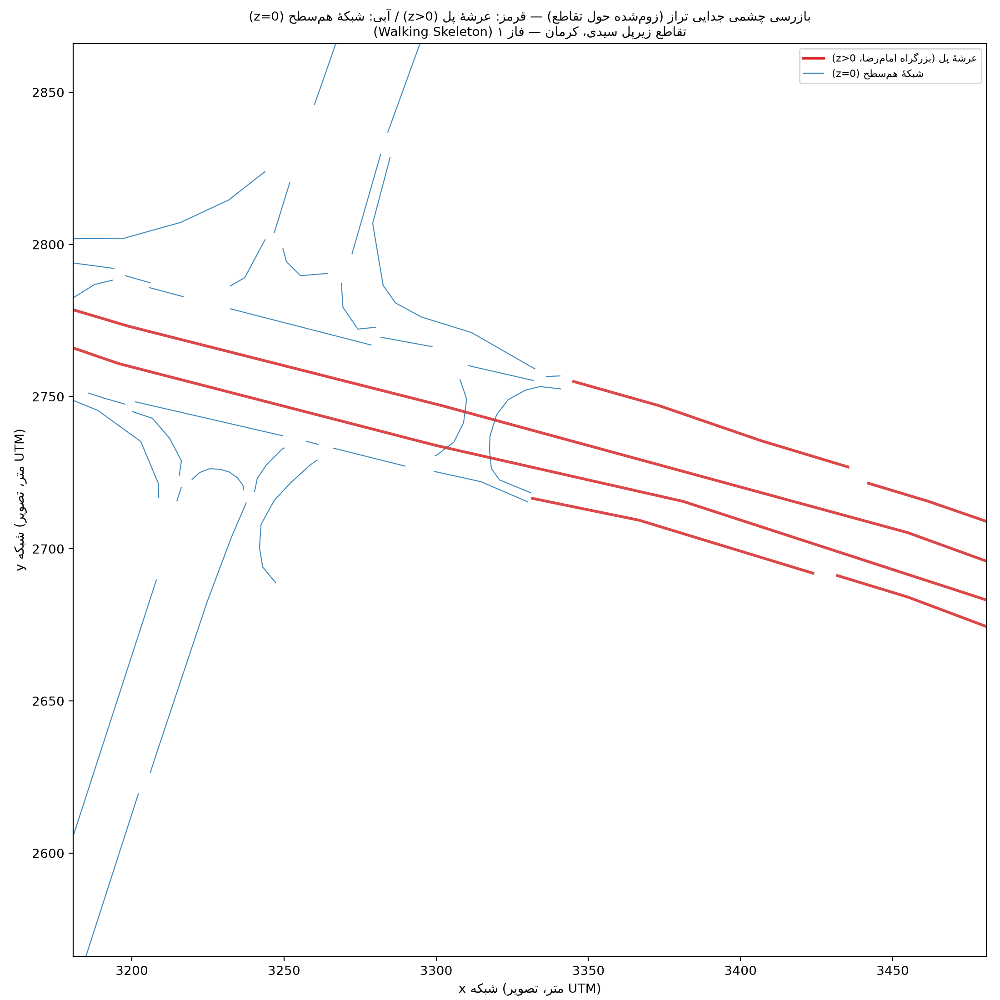{#fig-layer-check width=85%}

### ۳.۲ تقاضا (Demand) — «چند وسیله، از کجا به کجا»

برخلاف مطالعات ناحیه‌ای که به ماتریس مبدأ-مقصد (OD) کامل نیاز دارند، برای یک
تقاطع منفرد، **حجم ورودی هر پا + نسبت گردش‌ها** داده‌ای به‌مراتب کم‌نیازتر و
در دسترس‌تر است. ابزار `jtrrouter` دقیقاً همین کار را می‌کند: با گرفتن حجم هر
ورودی و نسبت مستقیم/راست/چپ در هر انشعاب، مسیر تک‌تک وسایل را می‌سازد. تقاضای
پایه (رجوع به `config/assumptions.yml`) در نبود شمارش میدانی، از قضاوت
مهندسی (تعداد خط × ظرفیت تقریبی خط) گرفته شده و به همین دلیل به‌عنوان یکی از
عوامل تحلیل حساسیت (λ) آزموده می‌شود، نه یک عدد قطعی.

### ۳.۳ ناوگان و رفتار راننده — «نه همه مثل هم رانندگی نمی‌کنند»

شش دستهٔ وسیله (سواری، موتورسیکلت با سهم ۳۰٪، تاکسی، وانت، اتوبوس، کامیونت)
با پارامترهای رفتاری جداگانه تعریف شده‌اند (`config/vtypes.yml`). نکات کلیدی:

- **موتورسیکلت با سهم بالا (۳۰٪):** بازتاب مشاهدهٔ کیفی تصاویر (نه شمارش)
  — بالاترین اولویت برنامهٔ کالیبراسیون آینده.
- **مدل sublane فعال** (`--lateral-resolution 0.8`): بدون آن، SUMO هر خط را
  یک واحد صلب می‌بیند و فیلترینگ موتورسیکلت بین خطوط (رفتار واقعی و
  مشاهده‌شده در تصاویر) قابل‌بازنمایی نیست.
- **پارامترهای تهاجمی‌تر از پیش‌فرض SUMO:** فاصلهٔ زمانی پیرو (`tau`) کوتاه‌تر،
  بی‌اعتنایی به حق‌تقدم (`jmIgnoreFoeProb`) و جسارت تغییر خط (`lcAssertive`)
  بالاتر — به‌ویژه برای موتورسیکلت — برای بازتاب فرهنگ رانندگی نزدیک‌به‌هم
  ایرانی. همهٔ این پارامترها با فلگ `sensitivity: true` ثبت شده‌اند؛ همان‌طور
  که در بخش ۱۰ خواهیم دید، همین پارامترها احتمالاً **علت اصلی** یافتهٔ
  ضدشهودی S1 هستند.

### ۳.۴ طراحی آزمایش — چند-سناریو × چند-تقاضا × چند-seed

هیچ نتیجهٔ شبیه‌سازی تصادفی را نباید با یک اجرا قضاوت کرد — تصادف در
رفتار راننده (`sigma`) و انتساب مسیر می‌تواند به‌تنهایی نتیجه را جابه‌جا کند.
به همین دلیل، طبق قاعدهٔ سخت ۵ پروژه، هر ترکیب (سناریو × سطح تقاضا) **۱۰ بار
با seedهای مستقل** (۱ تا ۱۰) تکرار می‌شود و میانگین ± فاصلهٔ اطمینان ۹۵٪
(با توزیع t، مناسب نمونهٔ کوچک) گزارش می‌شود. سطح تقاضا نیز در ۵ ضریب مقیاس
(λ = ۰.۶، ۰.۸، ۱.۰، ۱.۲، ۱.۴ برابر تقاضای فرضی مبنا) آزموده می‌شود تا مشخص
شود رتبه‌بندی سناریوها در چه بازه‌ای از تقاضا پایدار می‌ماند.

### ۳.۵ معیارها (KPI) و روش آماری مقایسه

هر اجرا خروجی‌های زیر را تولید می‌کند: `tripinfo` (مدت سفر، تلف‌شدگی زمان،
انتظار، به‌ازای هر وسیله)، `summary` (آیا همهٔ تقاضا وارد شبکه شد؟)،
`statistic` (تعداد برخورد کل)، `queue` (طول صف هر خط در طول زمان — برای
بررسی خطر سرریز به رمپ)، و دستگاه `SSM` (شاخص‌های ایمنی جانشین TTC/DRAC/PET).
چون هر seed در همهٔ سناریوها همان تقاضای پایه را تولید می‌کند (seedهای
مشترک)، مقایسهٔ سناریوها با **آزمون t زوجی (paired t-test)** و **اندازهٔ اثر
Cohen's d زوجی** انجام می‌شود — نه فقط درصد تفاوت میانگین‌ها، که می‌تواند
گمراه‌کننده باشد.

## ۴. سناریوها — شرح مبسوط

جدول زیر وضعیت فعلی هر سناریو را نشان می‌دهد؛ شرح کامل هرکدام در ادامه آمده
و هرکدام یک پوشهٔ مستقل با `README.md` طراحی دارد (`scenarios/<کد>/README.md`).

```{python}
#| label: tbl-scenario-status
#| tbl-cap: "وضعیت ساخت هر سناریو"
import yaml
from IPython.display import Markdown
import pandas as pd
scen_cfg = yaml.safe_load(open("../config/scenarios.yml", encoding="utf-8"))["scenarios"]
status_fa = {"built": "ساخته و شبیه‌سازی‌شده", "planned": "طراحی مفهومی (هنوز ساخته نشده)"}
rows = [{"کد": k, "عنوان": v["label_fa"], "وضعیت": status_fa[v["status"]]} for k, v in scen_cfg.items()]
Markdown(pd.DataFrame(rows).to_markdown(index=False))
```

### S0 — حفظ وضع موجود (Do-Nothing)

مبنای مقایسهٔ همهٔ سناریوهای دیگر. هندسه دقیقاً همان چیزی است که امروز وجود
دارد: بدون چراغ، بدون کانالیزاسیون رسمی. نقاط ادغام زیر پل با junction model
از نوع `zipper` مدل شده‌اند — نوع ویژهٔ SUMO برای بازنمایی ادغام امنِ
«هرکه‌زودتر‌رسید» (fade-in merge)، دقیقاً رفتاری که در تصاویر و تأیید کاربر
در Checkpoint ۱ («گردش چپ آزاد و غیررسمی است») مشاهده شد.

{#fig-s0-diagram width=80%}

### S1 — تبدیل به تقاطع چراغ‌دار (Signalized Intersection)

**یافتهٔ توپولوژیک پیش از طراحی:** بررسی شبکه نشان داد زیر پل هیچ گرهٔ
تقاطعی واقعی (هم‌زمان ≥۲ ورودی و ≥۲ خروجی) ندارد — OSM آن را به زنجیره‌ای از
حدود ۲۴ گرهٔ ریز رمپ/ادغام/انشعاب تجزیه کرده، دقیقاً هم‌راستا با توصیف
«شبه‌میدان بدون کانالیزاسیون» فاز ۰. این یافته با کاربر در میان گذاشته شد و
تصمیم زیر گرفته شد (رجوع به `config/assumptions.yml -> signal_design_S1`
برای شرح کامل):

> به‌جای ادغام پرریسک این ۲۴ گره به یک تقاطع مصنوعی واحد، یا یک برنامهٔ چراغ
> مشترک (joined) روی زنجیره‌ای ۱۵۰متری از نقاط ادغام که در واقعیت هم‌زمان
> اتفاق نمی‌افتند، **هر گرهٔ ادغام واقعی (in-degree≥۲) درون میدانچهٔ ویوینگ
> به‌طور مستقل چراغ‌دار می‌شود** — با یک طول سیکل مشترک، محاسبه‌شده با روش
> کلاسیک **وبستر (Webster)**.

طول سیکل بهینه برای تقاضای طراحی (λ=۱.۰) محاسبه شد:

```{python}
#| label: tbl-webster
#| tbl-cap: "محاسبهٔ سیکل وبستر برای S1 (طبق src/08_webster_timing.py)"
timing = yaml.safe_load(open("../config/signal_timing_S1.yml", encoding="utf-8"))
rows = [
    {"پارامتر": "نسبت جریان بحرانی فاز A (عبوری شمال-جنوب)", "مقدار": f"{timing['critical_flow_ratios']['y_A']:.3f}"},
    {"پارامتر": "نسبت جریان بحرانی فاز B (گردش از عرشه)", "مقدار": f"{timing['critical_flow_ratios']['y_B']:.3f}"},
    {"پارامتر": "Y (مجموع نسبت‌های بحرانی)", "مقدار": f"{timing['critical_flow_ratios']['Y']:.3f}"},
    {"پارامتر": "طول سیکل بهینهٔ وبستر (ثانیه)", "مقدار": f"{timing['cycle_length_s']['final_used_s']:.1f}"},
    {"پارامتر": "سبز مؤثر فاز A / فاز B (ثانیه)", "مقدار": f"{timing['green_split_s']['phase_A_ns_through']:.1f} / {timing['green_split_s']['phase_B_bridge_turns']:.1f}"},
]
Markdown(pd.DataFrame(rows).to_markdown(index=False))
```

با Y≈۰.۵۹ (به‌وضوح زیر اشباع در تقاضای طراحی)، سیکل بهینه حدود ۴۲ ثانیه به
دست آمد. این سیکل در نسخهٔ **زمان‌ثابت (fixed)** بدون تغییر روی همهٔ ۵ سطح λ
اعمال شد؛ نسخهٔ **actuated** به‌جای سیکل ثابت، از منطق gap-out پیش‌فرض SUMO
استفاده می‌کند که سبز را بر اساس حضور واقعی وسیله کوتاه/بلند می‌کند.

**یافتهٔ جانبی جالب در ساخت شبکه:** از ۱۰ گرهٔ نامزد (in-degree≥۲ درون شعاع
میدانچه)، فقط **۵ گره** واقعاً حرکات متعارض (foes) داشتند و برنامهٔ
چندفازهٔ معنادار گرفتند؛ ۵ گرهٔ دیگر merge بدون تعارض واقعی بودند و
`netconvert` خودش آن‌ها را «سبز دائم» گذاشت — نشان می‌دهد بخشی از آنچه در
نگاه اول «محل تعارض» به نظر می‌رسید، در واقع صرفاً اتصال آزاد بدون تعارض
بوده است.

**بازطراحی واقعی فازبندی (نه فقط سیکل خام).** نسخهٔ اولیه فقط طول سیکل
وبستر را با `--tls.cycle.time` تحمیل می‌کرد و توزیع سبز/زرد داخلی هر گره
را کاملاً به هیوریستیک خودکار netconvert (عملاً نزدیک ۵۰/۵۰، بدون هیچ بازهٔ
همه‌قرمز) واگذار می‌کرد. `src/10_signal_design.py` این را جایگزین کرد: با
یک ساخت دوپاسی، گروه‌بندی واقعی تعارض هر گره (از خود netconvert، نه حدس)
حفظ می‌شود، اما زمان‌بندی هر فاز از نو طراحی می‌شود — سبز به‌نسبت تعداد
اتصال‌های آن فاز (پروکسی ظرفیت نسبی، مستند به‌عنوان ساده‌سازی در نبود
شمارش حرکت‌به‌حرکت واقعی) از سیکل وبستر، به‌علاوهٔ یک **بازهٔ همه‌قرمز
واقعی** — محاسبه‌شده از طولانی‌ترین لاین داخلی همان گره در net.xml (مسافت
واقعی تخلیهٔ تقاطع) تقسیم بر سرعت طراحی تخلیه، نه یک عدد یکسان حدسی برای
همهٔ گره‌ها. نسخهٔ actuated فقط همین همه‌قرمز را می‌گیرد؛ منطق gap-out
دست‌نخورده می‌ماند. **نتیجهٔ صادقانه:** این بازطراحی داستان اصلی S1 را
تغییر نداد — رجوع به بخش ۷ (مکانیزم ۵) برای تحلیل کامل.

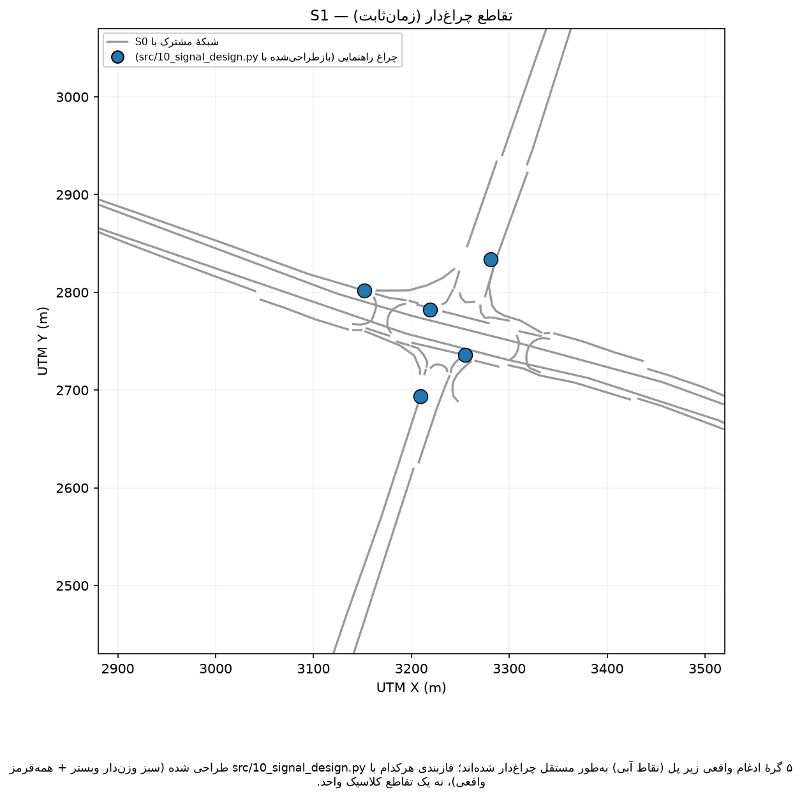{#fig-s1-diagram width=80%}

### S2 — محدودسازی گردش‌ها + دوربرگردان فیزیکی (RCUT / Median U-Turn)

**وضعیت: ساخته و شبیه‌سازی‌شده (نسخهٔ ۲ — کامل).** معادل بین‌المللی: RCUT
(Restricted Crossing U-Turn) یا Median U-Turn (چپِ میشیگان) — گردش چپ
مستقیم زیر پل حذف می‌شود و خودرو به‌جای آن مستقیم/راست ادامه می‌دهد و در
دوربرگردانی دور از تقاطع (قید صریح کاربر: دور از مرکز پل، چون سرعت روی عرشه
بالاست) مسیرش را کامل می‌کند.

بررسی هندسی نقاط انشعاب (diverge) درون میدانچهٔ ویوینگ ۹ گرهٔ تصمیم‌گیری
واقعی را آشکار کرد که هرکدام دقیقاً بین عبوری و یکی از چپ‌گرد/راست‌گرد
انتخاب می‌کنند؛ از این ۹، **۵ گره** گزینهٔ چپ‌گرد داشتند و آن اتصال از
plain-XML حذف شد. سپس دو یال بلند عرشه (شرق‌گرد/غرب‌گرد) هرکدام با
**درون‌یابی طول‌کمانی روی شکل واقعی یال** در دو نقطه (±D متر از مرکز)
شکافته و یک یال دوربرگردان کوتاه در هر نقطه افزوده شد. D به‌عنوان متغیر
حساسیت در سه سطح **۱۵۰ / ۲۵۰ / ۳۵۰ متر** ساخته شد. تقاضا با مکانیزم تازهٔ
`extra_turn_rules` هدایت می‌شود: ۱۵٪ از ترافیک عبوری هر نقطه (برابر سهم
گردش چپ حذف‌شده) واقعاً مسیر «عبور → دوربرگردان → بازگشت → گردش راست» را
طی می‌کند — نه فقط بازتوزیع آماری مقصد. رجوع به `scenarios/S2_rcut/README.md`.

**نکتهٔ راستی‌آزمایی مو‌به‌مو (۱۴۰۵/۰۶/۲۴):** بازبینی مستقیم داده‌های خام OSM
(`docs/network_audit.md`) نشان داد وضع موجود (S0) از قبل یک مسیر بازگشت/
دوربرگردانِ غیررسمی نزدیک به مرکز میدانچه (یال ۱۱۶۵۳۲۹۱۳۴، تگ OSM
`turn:lanes=reverse`، ~۷۰ متری) دارد — احتمالاً بخشی از رمپ حلقوی شمالی.
بنابراین S2 دقیقاً یک قابلیت از صفر اضافه نمی‌کند؛ بلکه این مسیر بازگشتی
*نزدیک و کنترل‌نشده* را با یک مسیر بازگشتی *دورتر و طراحی‌شده* (۱۵۰-۳۵۰ متر،
با طول شتاب‌گیری/کاهش‌سرعت مهندسی‌شده) جایگزین می‌کند — یعنی معاوضهٔ اصلی S2
«فاصله در ازای ایمنی/نظم»، نه «دوربرگردان در ازای بدون‌دوربرگردان».

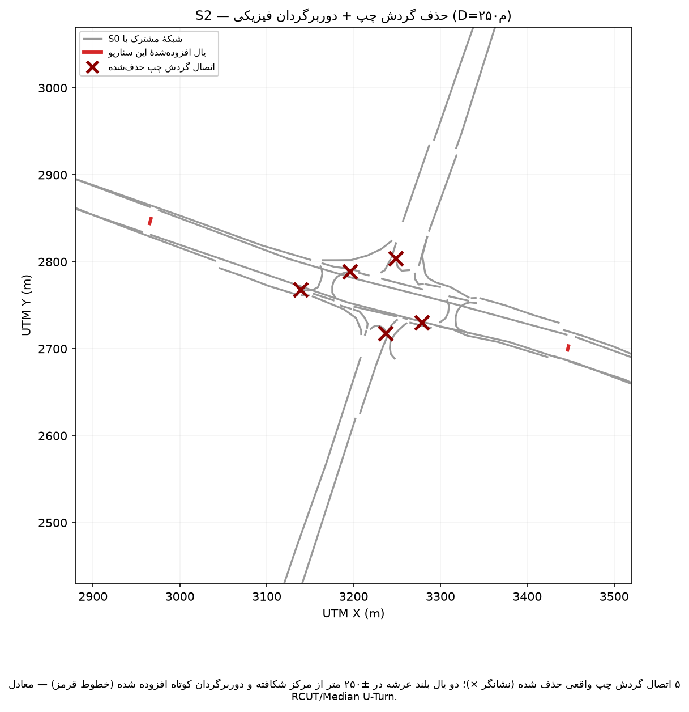{#fig-s2-diagram width=80%}

### S3 — میدان نامتقارن (دو گزینه)

**وضعیت: ساخته و شبیه‌سازی‌شده (هر دو گزینه).** طبق Checkpoint کاربر
(۱۴۰۵/۰۶/۲۳: «هر دو را بسازید، مقایسه‌ای»)، هر دو گزینه ساخته شد. چون زیر
پل یک گرهٔ تقاطعی واحد ندارد (همان یافتهٔ S1)، به‌جای ادغام/حذف زنجیرهٔ
~۲۴گرهیِ موجود، یک **حلقهٔ گردشی پادساعتگرد ۴یالی** میان چهار گرهٔ تلاقی
واقعی (نزدیک‌ترین گره‌های موجود به ورودی شمال/جنوب و دو دهانهٔ باز
غرب/شرق) افزوده شد — **بدون حذف** هیچ گره/یال قبلی. یال‌های حلقه اولویت
عددی بالا و `pass="true"` می‌گیرند (حق‌تقدم گردشی بدون قیدوشرط):

- **`constrained`:** فقط حلقهٔ ۴یالی، محدود به دو دهانهٔ باز موجود.
- **`full`:** همان حلقه + یک وتر مستقیم غرب-شرق که فرضاً از جزیرهٔ سه‌دهانه‌ایِ
  بستهٔ میانی (با بازشدن حداقل یکی از سه دهانه‌اش) عبور می‌کند — مشروط به
  تأیید ظرفیت باربری سازه، خارج از حیطهٔ این مطالعه.

هر دو نسخه با اجرای آزمایشی تأیید شدند (همهٔ وسایل کامل شدند)؛ `constrained`
نرخ کوچک teleport («خط اشتباه»، ۰.۱٪) نشان داد که به‌احتمال زیاد از
عدم‌تطابق تعداد خط یال‌های تک‌خطهٔ حلقه با یال‌های چندخطهٔ اصلی ناشی
می‌شود — رجوع به `scenarios/S3_roundabout/README.md` برای محدودیت‌های
صریح این پیاده‌سازی مفهومی (هندسهٔ حلقه خط‌راست بین ۴ نقطه است، نه دایرهٔ
مهندسی‌شده با انحراف/جزیره).

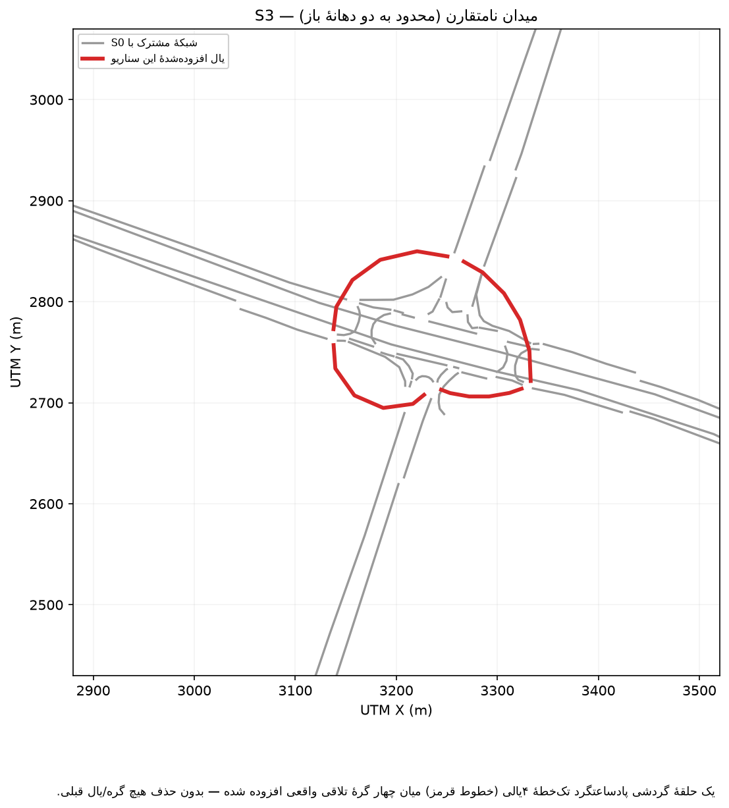{#fig-s3c-diagram width=80%}

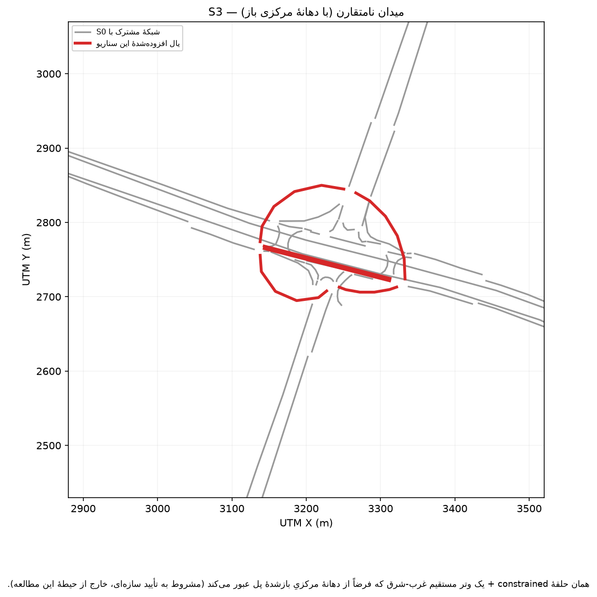{#fig-s3f-diagram width=80%}

### S4 — کانالیزاسیون + گردش راست آزاد (Channelization + Free Right)

**وضعیت: ساخته و شبیه‌سازی‌شده.** کم‌تهاجمی‌ترین مداخلهٔ هندسی از میان
سناریوها: همان ۵ گرهٔ ادغام واقعی که در S1 تعارض داشتند، از `zipper` به
`priority` بازگردانده شدند و اتصال عبوریِ اصلیِ هرکدام `pass="true"` گرفت
(حق‌تقدم بدون قیدوشرط، طبق قرارداد متعارف مسیر اصلی)؛ گردش راست کانالیزه‌شده
حق‌تقدم minor شفاف (به‌جای مذاکرهٔ مبهم zipper) گرفت. بدون نیاز به گرهٔ جدید
در توپولوژی. «حذف پارک حاشیه‌ای» در مدل پایه اصلاً لحاظ نشده بود، پس اثر
شبکه‌ای ندارد (رجوع به `scenarios/S4_channelization/README.md`).

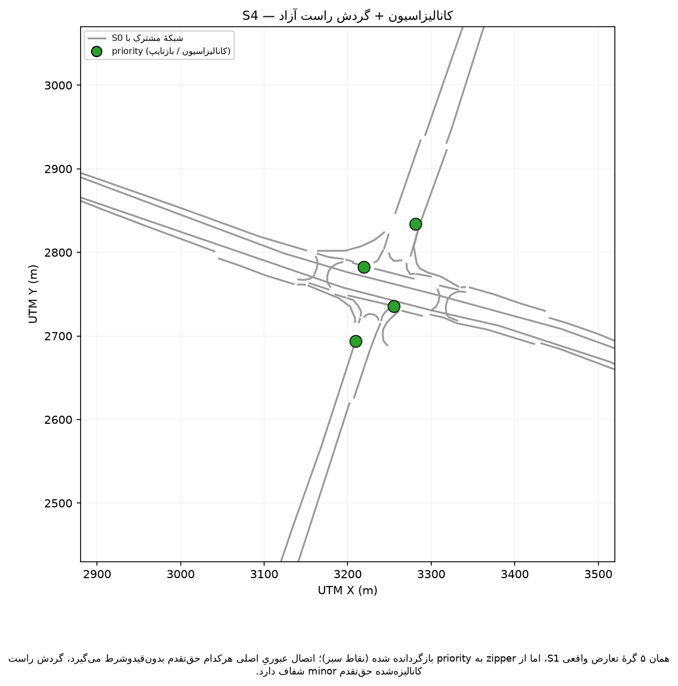{#fig-s4-diagram width=80%}

### S5 — ترکیبی/خلاقانه (Hybrid)

**وضعیت: ساخته و شبیه‌سازی‌شده (دو ایدهٔ اول از سه ایدهٔ ابتکاری؛ بای‌پس در
سه طرح کنترل آزموده شد).** چهار نسخه روی زیرساخت حلقهٔ گردشی
S3-constrained ساخته شدند: **metering** (میدان + چراغ متردهندهٔ تک‌گرهی
روی پای غرب، سیکل کوتاه ۲۰ ثانیه)، **oneway_priority** (میدان + بای‌پس
مستقیم دوطرفهٔ شمال-جنوب با حق‌تقدم بدون‌قیدوشرط، اولویت عددی حتی بالاتر
از خودِ حلقه)، **oneway_yield** (همان بای‌پس با حق‌تقدم عادی/یالدهنده —
اولویت پایین‌تر از حلقه، بدون قیدوشرط)، و **oneway_signal** (همان بای‌پس
با گرهٔ تعارض بازتایپ‌شده به چراغ راهنمایی واقعی، طراحی‌شده با همان روش
`src/10_signal_design.py` که S1 استفاده کرد و سیکل وبستر مخصوص این گرهٔ
کوچک ≈۵۳ ثانیه). برخلاف وترِ S3-full، بای‌پس نیازی به بازشدن دهانهٔ مرکزی
ندارد چون بلوار سیدی همین حالا هم‌سطح عبور می‌کند. ایدهٔ سوم (بازکردن
دهانهٔ مرکزی برای گردش‌های سبک) با S3-full هم‌پوشانی مفهومی دارد و ساخته
نشد. هر چهار نسخه در قالب فعلی‌شان بدتر از S0 عمل می‌کنند، اما با شدت بسیار
متفاوت — متردهنده نسبت به حلقهٔ خام S3-محدود در تقاضای اوج کمی بهبود
می‌دهد. **بای‌پس، در هر سه طرح کنترل آزموده‌شده** (بدون‌قیدوشرط، سپس
یالدهنده پس از رفع تداخل هندسی مستندش، سپس چراغ راهنمایی واقعی)، همچنان
ضعیف می‌ماند — نه به‌دلیل مقاومت در برابر رفع، بلکه چون ریشهٔ اصلی مشکل،
وجود همین نقطهٔ تعارض اضافه است، نه هندسه، طرح حق‌تقدم، یا نوع کنترلش.
چراغ راهنمایی واقعی، برخلاف انتظار، **بدترین** نتیجهٔ سه‌گانه شد (λ=۱.۴:
۳۲۵۷.۶ برخورد در هر اجرا، بیشتر حتی از بدترین حالت S1) — رجوع به بخش ۷
برای تحلیل کامل.

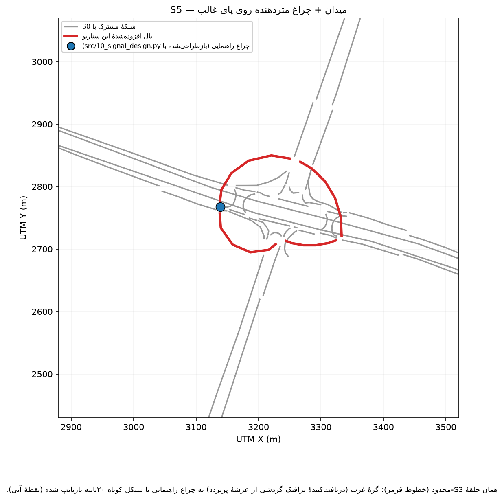{#fig-s5m-diagram width=80%}

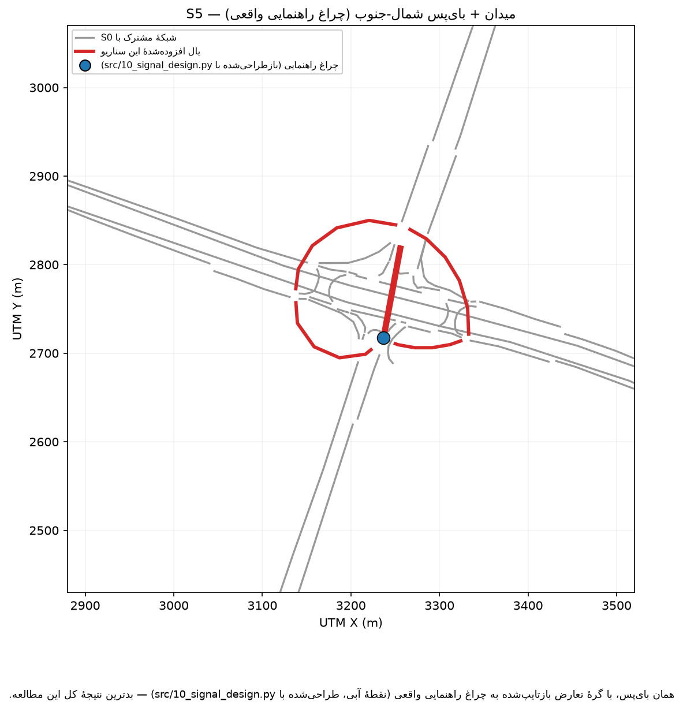{#fig-s5b-diagram width=80%}

### ترکیبی S2+S4 — حذف گردش چپ + دوربرگردان، هم‌زمان با کانالیزاسیون گردش راست

**وضعیت: ساخته و شبیه‌سازی‌شده (نشست ۵، طبق گام ۳ بخش ۱۲).** این سناریو
فراتر از شش گزینهٔ اصلی S0-S5 است — پاسخی مستقیم به یافتهٔ تکرارشدهٔ این
مطالعه که «حذف تعارض هندسی بدون افزودن کنترل فعال» (S2، S4) دست‌کم
هم‌تراز و گاه بهتر از افزودن کنترل فعال کالیبره‌نشده (S1، S5) عمل
می‌کند. پرسش: آیا این دو اصلاح کم‌ریسک را می‌توان هم‌زمان روی یک شبکه
اعمال کرد؟ **هیچ منطق تازه‌ای ساخته نشد** — `scenarios/S2_S4_combined/build_network.py`
دقیقاً همان دو تابع موجود S2 (`apply_s2_modifications`، D=۲۵۰م مبنا) و
S4 (`retype_nodes_to_priority` + `mark_free_right_connections`) را روی
یک plain-XML مشترک، به‌ترتیب، فراخوانی می‌کند. ترکیب بدون تداخل ممکن است
چون گره‌های S2 (انشعاب) و S4 (ادغام) دو مجموعهٔ گرهٔ فیزیکی کاملاً مجزا
هستند — رجوع به `scenarios/S2_S4_combined/README.md` برای جدول کامل
گره‌ها و تأیید نبود هم‌پوشانی.

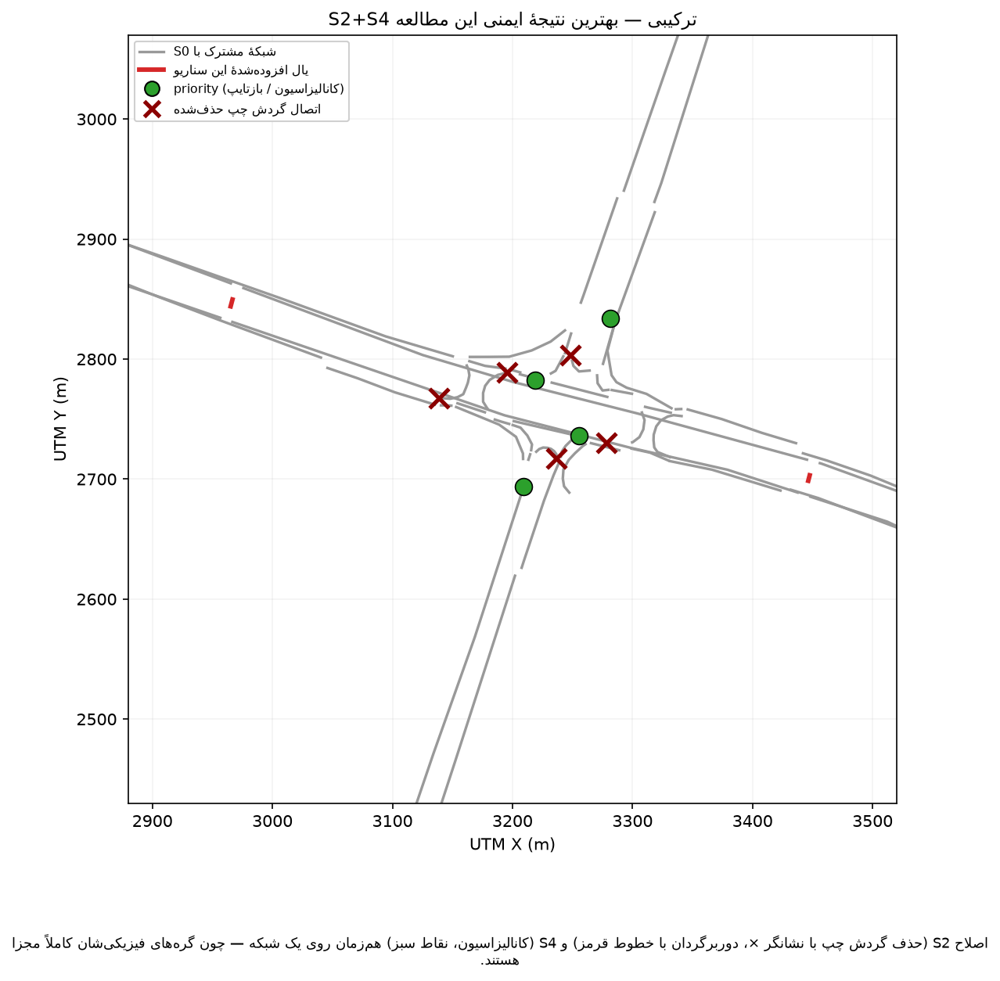{#fig-s2s4-diagram width=80%}

## ۵. نتایج: هر ۶ سناریوی اصلی + یک ترکیب

```{python}
#| echo: false
SCEN_LABELS = [("s0", "S0"), ("s1_fixed", "S1-ثابت"), ("s1_actuated", "S1-actuated"),
               ("s2", "S2 (D=250m)"), ("s3_constrained", "S3-محدود"), ("s3_full", "S3-کامل"),
               ("s4", "S4"), ("s5_metering", "S5-متردهنده"), ("s5_oneway", "S5-بای‌پس (بدون‌قیدوشرط)"),
               ("s5_oneway_yield", "S5-بای‌پس (یالدهنده)"), ("s5_oneway_signal", "S5-بای‌پس (چراغ واقعی)"),
               ("s2s4", "S2+S4 ترکیبی")]
```

### ۵.۱ تأخیر (تلف‌شدگی زمان)

```{python}
#| label: tbl-timeloss-compare
#| tbl-cap: "میانگین تلف‌شدگی زمان (ثانیه/وسیله) بر حسب λ — ۷ نسخهٔ کنترلی اصلی، ۱۰ seed هرکدام"
frames = []
for prefix, label in SCEN_LABELS:
    d = pd.read_csv(f"../outputs/tables/{prefix}_lambda_summary.csv")
    d = d[d["metric"] == "mean_timeloss_s"][["lambda", "mean"]].copy()
    d["سناریو"] = label
    frames.append(d)
dfc = pd.concat(frames, ignore_index=True)
dfc = dfc.pivot(index="lambda", columns="سناریو", values="mean").round(1)
Markdown(dfc.to_markdown())
```

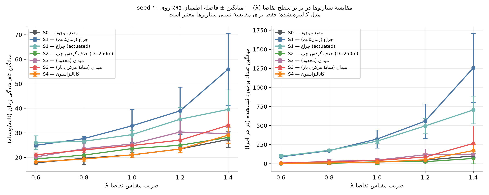{#fig-scenario-comparison width=95%}

**S1 (هر دو نسخه)** در **هر پنج سطح λ** تأخیر بالاتری نسبت به S0 دارد — از
حدود ۴۰٪ در تقاضای پایین تا بیش از ۱۰۰٪ (نسخهٔ زمان‌ثابت) در تقاضای بالا.
**S4** عملاً روی هم منطبق با S0 در تمام بازهٔ λ می‌ماند. **S2** (با
دوربرگردان واقعی) کمی بالاتر از S0 در λهای پایین/میانی است اما در λ=۱.۴
عملاً هم‌تراز می‌شود. **S3 (هر دو گزینه)** الگوی متفاوتی دارد: فاصلهٔ
محسوس با S0 در λ پایین (۱۳-۱۸٪ بالاتر)، که با افزایش تقاضا به‌تدریج
کوچک‌تر می‌شود — الگوی شناخته‌شدهٔ میدان‌ها (هزینهٔ ثابت هندسی که در تقاضای
کم غالب است، اما با بالارفتن تقاضا نسبت به گزینه‌های رقیب کمرنگ‌تر می‌شود).

### ۵.۲ ایمنی (برخورد ثبت‌شده و صف)

```{python}
#| label: tbl-collision-compare
#| tbl-cap: "میانگین تعداد برخورد ثبت‌شده در هر اجرا، بر حسب λ"
frames = []
for prefix, label in SCEN_LABELS:
    d = pd.read_csv(f"../outputs/tables/{prefix}_lambda_summary.csv")
    d = d[d["metric"] == "n_collisions"][["lambda", "mean"]].copy()
    d["سناریو"] = label
    frames.append(d)
dfc = pd.concat(frames, ignore_index=True)
dfc = dfc.pivot(index="lambda", columns="سناریو", values="mean").round(1)
Markdown(dfc.to_markdown())
```

تعداد برخورد ثبت‌شده در S1 (هر دو نسخه، با فازبندی بازطراحی‌شدهٔ واقعی) به‌طور
چشمگیری بالاتر از S0 است — در λ=۱.۴، نسخهٔ زمان‌ثابت حدود ۱۶ برابر S0 برخورد
ثبت می‌کند (ریشه در بخش ۶ تحلیل شده: عمدتاً محصول تعامل صف‌سازی با رفتار
تهاجمی کالیبره‌نشده، نه خودِ چراغ — و بازطراحی فازبندی این نسبت را کمی
بدتر کرد، نه بهتر، رجوع به بخش ۷). **S5-بای‌پس با چراغ راهنمایی واقعی**
در λ=۱.۴ با ۳۲۵۷.۶ برخورد میانگین، بدترین عدد کل این جدول است — بیشتر
حتی از S1. **S4** در همهٔ سطوح λ عملاً هم‌ردهٔ S0 است. **S2** برخورد
کمتری از S0 در λهای بالا نشان می‌دهد (غیرمعنادار آماری اما جهت‌دار).
**S3 (هر دو گزینه)** برخورد بیشتری از S0 نشان می‌دهد، به‌ویژه در `full`
در λ=۱.۴ (۲۶۶ در برابر ۱۰۲ برای S0) — این به‌احتمال زیاد تا حدی مصنوعِ
سادگی هندسهٔ حلقهٔ این نسخه (خطوط تک‌خطه، بدون انحراف/جزیرهٔ مهندسی‌شده)
است، نه لزوماً نتیجهٔ ذاتی مفهوم میدان (رجوع به بخش ۷ و ۱۱).

```{python}
#| label: tbl-queue-compare
#| tbl-cap: "حداکثر طول صف مشاهده‌شده (متر) بر حسب λ"
frames = []
for prefix, label in SCEN_LABELS:
    d = pd.read_csv(f"../outputs/tables/{prefix}_lambda_summary.csv")
    d = d[d["metric"] == "max_queue_length_m"][["lambda", "mean"]].copy()
    d["سناریو"] = label
    frames.append(d)
dfc = pd.concat(frames, ignore_index=True)
dfc = dfc.pivot(index="lambda", columns="سناریو", values="mean").round(1)
Markdown(dfc.to_markdown())
```

### ۵.۳ معنی‌داری آماری و اندازهٔ اثر

```{python}
#| label: tbl-stats-compare
#| tbl-cap: "مقایسهٔ زوجی هر سناریو در برابر S0 روی seedهای مشترک — تلف‌شدگی زمان"
dfstat = pd.read_csv("../outputs/tables/scenario_comparison.csv")
scen_map = {"s1_fixed": "S1-ثابت", "s1_actuated": "S1-actuated",
            "s2": "S2", "s3_constrained": "S3-محدود", "s3_full": "S3-کامل", "s4": "S4",
            "s5_metering": "S5-متردهنده", "s5_oneway": "S5-بای‌پس (بدون‌قیدوشرط)",
            "s5_oneway_yield": "S5-بای‌پس (یالدهنده)", "s5_oneway_signal": "S5-بای‌پس (چراغ واقعی)",
            "s2s4": "S2+S4 ترکیبی"}
key = dfstat[(dfstat["metric"] == "mean_timeloss_s") &
             (dfstat["scenario"].isin(scen_map.keys()))][
    ["scenario", "lambda", "pct_diff", "p_value", "cohens_dz"]
].copy()
key.columns = ["سناریو", "λ", "درصد تفاوت با S0", "p-value (t زوجی)", "اندازهٔ اثر Cohen's dz"]
key["سناریو"] = key["سناریو"].map(scen_map)
Markdown(key.round(3).to_markdown(index=False))
```

```{python}
#| label: tbl-stats-collision
#| tbl-cap: "مقایسهٔ زوجی S2/S3/S4/S5 در برابر S0 — تعداد برخورد و حداکثر طول صف"
collision_scens = ["s2", "s3_constrained", "s3_full", "s4", "s5_metering", "s5_oneway", "s5_oneway_yield", "s5_oneway_signal", "s2s4"]
key2 = dfstat[(dfstat["metric"].isin(["n_collisions", "max_queue_length_m"])) &
              (dfstat["scenario"].isin(collision_scens))][
    ["scenario", "lambda", "metric", "pct_diff", "p_value"]
].copy()
metric_fa = {"n_collisions": "تعداد برخورد", "max_queue_length_m": "حداکثر طول صف"}
key2["metric"] = key2["metric"].map(metric_fa)
key2["scenario"] = key2["scenario"].map(scen_map)
key2.columns = ["سناریو", "λ", "معیار", "درصد تفاوت با S0", "p-value"]
Markdown(key2.round(3).to_markdown(index=False))
```

جمع‌بندی معنی‌داری: **S1 (هر دو نسخه)** در همهٔ ۱۰ مقایسهٔ تأخیر معنی‌دار و
بدتر از S0 است، با اندازهٔ اثر بزرگ تا بسیار بزرگ. **S4** در **هیچ** سطح λ
تفاوت معنی‌داری با S0 در تأخیر نشان نمی‌دهد. **S2** فقط در λ=۰.۶، ۱.۰ و
۱.۲ معنی‌دار (و اندکی بدتر) است؛ در λ=۰.۸ و ۱.۴ (تقاضای اوج) تفاوت معنی‌دار
نیست. **S3 (هر دو گزینه، هندسهٔ بازبینی‌شدهٔ نهایی)** در بیشتر λهای
پایین/میانی معنی‌دار و بدتر است، اما در λ=۱.۴ دیگر معنی‌دار نیست — الگوی
«هزینهٔ ثابت هندسی که با افزایش تقاضا کمرنگ می‌شود». **S5-متردهنده** در
اکثر λها معنی‌دار و بدتر از S0 است، اما در λ=۱.۴ (نقطهٔ تمایزدهنده)
معنی‌دار نیست. **S5-بای‌پس، در هر سه طرح کنترل آزموده‌شده**، در اکثر λها
معنی‌دار و بدتر از S0 است؛ طرح یالدهنده در همهٔ ۵ سطح λ معنی‌دار است، و
طرح چراغ راهنمایی واقعی بدترین اندازهٔ اثر کل این جدول را دارد (رجوع
به بخش ۷، مکانیزم ۵، برای تحلیل کامل هر دو طرح).

**یافتهٔ برجستهٔ این بخش: S2+S4 ترکیبی.** برخلاف همهٔ سناریوهای بالا، این
سناریو در معیار ایمنی نتیجهٔ **مثبت و قوی** نشان می‌دهد: تعداد برخورد در
λ=۱.۰، ۱.۲ و ۱.۴ به‌ترتیب ۸۴٪، ۸۰٪ و ۸۳٪ **کمتر** از S0 است — هر سه
معنی‌دار (p=۰.۰۴۶، ۰.۰۱۶، ۰.۰۰۱) با اندازهٔ اثر بزرگ تا بسیار بزرگ
(Cohen's dz تا ۱.۵۸-)؛ حداکثر طول صف هم در λ=۱.۲ و ۱.۴ به‌ترتیب ۶۰٪ و
۷۱٪ کمتر (معنی‌دار). تأخیر تنها در λ=۰.۶ و ۱.۰ اندکی بدتر (معنی‌دار،
۶-۶٪) است؛ در λ=۰.۸، ۱.۲ و ۱.۴ تفاوت معنی‌دار نیست — و در λ=۱.۴ حتی
جهت‌دار **بهتر** از S0 (۳.۳٪ کمتر). یعنی در تقاضای بالا (جایی که بیشترین
اهمیت را دارد)، این سناریو ایمنی به‌طور چشمگیر بهتر را **بدون هزینهٔ
محسوس در تأخیر** به دست می‌آورد — بهترین ترکیب تأخیر+ایمنی در کل این
مطالعه تا این مرحله. رجوع به بخش ۷ برای تفسیر مکانیزمی و بخش ۹ برای
جایگاه آن در رتبه‌بندی.

در معیارهای ایمنی برای بقیهٔ سناریوها، هیچ‌کدام از S2/S3/S4/S5 تفاوت
آماری معنی‌داری با S0 در اکثر λها نشان نمی‌دهند (واریانس بالای شمارش
برخورد در نمونهٔ ۱۰ seed) — با این حال جهت تفاوت‌ها (S2 بهتر، S3/S5-بای‌پس
بدتر در λ بالا) قابل‌توجه است.

## ۶. آزمون تشخیصی حساسیت رفتاری

یافتهٔ بخش ۵ («S1 بدتر از S0») غیرمنتظره است و می‌تواند دو ریشه داشته باشد:
(الف) خودِ طراحی سیگنال (سیکل ثابت روی تقاضای زیراشباع، Y≈۰.۵۹)، یا (ب)
تعامل با پارامترهای رفتاری تهاجمی کالیبره‌نشدهٔ این مطالعه (`tau` کوتاه،
`jmIgnoreFoeProb` تا ۰.۳۵ برای موتورسیکلت). برای جداسازی این دو، S0 و
S1-ثابت با **پارامترهای رفتاری پیش‌فرض واقعی SUMO** (نه تنظیمات تهاجمی این
مطالعه؛ رجوع به `config/vtypes_diagnostic_default.yml`) در همان ۵λ×۱۰seed
دوباره اجرا شدند (`src/09_behavior_diagnostic.py`، ۱۰۰ اجرای مستقل، جدا از
رجیستری رسمی سناریوها).

```{python}
#| label: tbl-diagnostic
#| tbl-cap: "آزمون تشخیصی: تلف‌شدگی زمان با رفتار پیش‌فرض SUMO (نه تهاجمی)"
diag = pd.read_csv("../outputs/tables/diag_behavior_default_comparison.csv")
diag.columns = ["λ", "میانگین S1-ثابت (رفتار پیش‌فرض)", "میانگین S0 (رفتار پیش‌فرض)",
                 "درصد تفاوت", "p-value"]
Markdown(diag.round(2).to_markdown(index=False))
```

```{python}
#| label: tbl-diagnostic-collision
#| tbl-cap: "آزمون تشخیصی: میانگین تعداد برخورد با رفتار پیش‌فرض SUMO"
dlam = pd.read_csv("../outputs/tables/diag_behavior_default_lambda_summary.csv")
dcol = dlam[dlam["metric"] == "n_collisions"][["scenario", "lambda", "mean"]].copy()
dcol["scenario"] = dcol["scenario"].map({"diag_s0": "S0 (رفتار پیش‌فرض)",
                                           "diag_s1_fixed": "S1-ثابت (رفتار پیش‌فرض)"})
dcol = dcol.pivot(index="lambda", columns="scenario", values="mean")
Markdown(dcol.to_markdown())
```

**دو نتیجهٔ متمایز و مکمل:**

1. **تأخیر:** حتی با رفتار پیش‌فرض (غیرتهاجمی)، S1-ثابت هنوز ۳۶٪ تا ۵۷٪
   تأخیر بیشتری از S0 دارد (همهٔ ۵ مقایسه معنی‌دار). یعنی **بخش عمدهٔ اثر
   تأخیر واقعاً به خودِ طراحی سیگنال برمی‌گردد** — تحمیل توقف پشت قرمز روی
   تقاضایی که در نبود چراغ می‌توانست بدون توقف کامل ادغام شود؛ رفتار تهاجمی
   این اثر را تشدید می‌کند (۴۵٪ تا ۱۴۲٪ در مدل اصلی، حتی پس از بازطراحی
   واقعی فازبندی با src/10_signal_design.py) اما آن را نمی‌سازد.
2. **ایمنی:** با رفتار پیش‌فرض، تعداد برخورد برای **هر دو** سناریو تقریباً
   صفر است (حداکثر ۰.۴ در هر اجرا، در برابر صدها در مدل اصلی). یعنی
   **انفجار برخورد که در بخش ۵.۲ دیدیم، تقریباً به‌طور کامل محصول تعامل
   صف‌سازیِ ناشیِ از چراغ با پارامترهای رفتاری تهاجمی کالیبره‌نشده است — نه
   ویژگی ذاتی خودِ چراغ.**

این تفکیک، پیام فاز ۴ را دقیق‌تر می‌کند: مسئلهٔ تأخیر S1 یک یافتهٔ مهندسی
واقعی است (طراحی سیگنال روی تقاضای زیراشباع)؛ مسئلهٔ ایمنی S1 عمدتاً یک
**زنگ خطر دربارهٔ کالیبراسیون رفتاری**، نه حکمی دربارهٔ خطرناک‌بودن ذاتی
چراغ راهنمایی.

## ۷. بحث و تفسیر

با احتساب آزمون تشخیصی بخش ۶، سه توضیح محتمل برای یافتهٔ بخش ۵ اکنون
می‌توانند وزن‌دهی شوند:

**۱. تقاضای طراحی زیر اشباع بود (Y≈۰.۵۹) — مکانیزم غالب تأخیر، تأییدشده.**
وقتی حجم ترافیک به‌وضوح زیر ظرفیت است، چراغ با سیکل ثابت، وسایلی را که در
نبود چراغ می‌توانستند بلافاصله و بدون توقف کامل ادغام شوند (زیپر/priority)،
مجبور به توقف پشت قرمز می‌کند. آزمون تشخیصی بخش ۶ نشان داد این مکانیزم
**به‌تنهایی** (بدون هیچ رفتار تهاجمی) کافی است تا S1 را ۳۶–۵۷٪ کندتر از S0
کند.

**۲. تعامل با مدل رفتاری تهاجمی (بدون کالیبراسیون) — مکانیزم غالب ایمنی،
تأییدشده.** بررسی محل برخوردها (بخش ۵.۲) نشان داد اکثریت قریب‌به‌اتفاق
برخوردهای S1 در **صفِ پشتِ چراغ** رخ می‌دهد، نه در نقطهٔ تقاطع. آزمون
تشخیصی بخش ۶ این را قطعی کرد: با رفتار پیش‌فرض، برخورد تقریباً ناپدید
می‌شود. **این چراغ نیست که ذاتاً ناامن است؛ صف‌سازی ناشی از چراغ است که با
فرهنگ رانندگی تهاجمیِ مدل‌شده (فاصلهٔ پیرو کوتاه، بی‌اعتنایی موتورسیکلت به
حق‌تقدم) برخورد می‌کند.**

**۳. تبدیل نوع گره از zipper به traffic_light — سهم کوچک، ثانویه.** بررسی
محل برخورد نشان داد سهم برخوردهای *داخل* گره‌های چراغ‌دار (نه روی یال‌های
میانی) کم است (کمتر از ۵٪ از کل) — این مکانیزم می‌تواند سهم کوچکی داشته
باشد اما مکانیزم غالب همان شمارهٔ ۲ (صف‌سازی) است.

**نتیجهٔ تکمیلی از S2/S4:** S4 (که هیچ کنترل فعالی اضافه نمی‌کند، فقط
تعارض راست‌گرد را کانالیزه می‌کند) هیچ تفاوت معنی‌داری با S0 ندارد؛ S2 (که
تعارض چپ‌گرد را کاملاً حذف می‌کند، باز هم بدون کنترل فعال) در تقاضای اوج
عملاً هم‌تراز S0 است و برخورد/صف بهتری نشان می‌دهد. این الگو — «حذف تعارض
هندسی بدون افزودن کنترل فعال، دست‌کم هم‌تراز (و گاه بهتر از) افزودن کنترل
فعال کالیبره‌نشده» — دقیقاً همان چیزی است که مکانیزم‌های ۱ و ۲ بالا پیش‌بینی
می‌کنند.

**۴. چرا S3 (میدان) در تقاضای پایین بدتر از S0 است، اما با افزایش تقاضا
بهتر می‌شود؟** این الگو (بخش ۵.۱/۵.۳) کاملاً با ادبیات مهندسی ترافیک
میدان‌ها سازگار است: یک میدان، حتی کوچک، یک **هزینهٔ هندسی ثابت** به هر
وسیله تحمیل می‌کند (کاهش سرعت برای ورود/انحراف، طول مسیر گردشی به‌جای خط
مستقیم) که در تقاضای پایین — وقتی عملاً رقیبی برای مسیر مستقیم/زیپر وجود
ندارد — این هزینهٔ ثابت نسبت به وضع موجود کاملاً «اضافه» به نظر می‌رسد؛ اما
با افزایش تقاضا، وضع موجود (S0) با نرخ تندتری بدتر می‌شود (چون هماهنگی
ضمنی زیپر در ازدحام بالا می‌شکند)، در حالی‌که میدان — تا وقتی گنجایش دارد —
با نرخ کندتری بدتر می‌شود؛ نتیجه، همگرایی تدریجی دو منحنی است که دقیقاً در
داده مشاهده شد. **افزایش برخورد S3** (به‌ویژه نسخهٔ full در λ بالا) احتمالاً
تا حد زیادی مصنوعِ سادگیِ این پیاده‌سازی مفهومی است: حلقه با خطوط تک‌خطه و
بدون انحراف/جزیرهٔ طراحی‌شده ساخته شده (رجوع به `scenarios/S3_roundabout/README.md`)
— یک میدان واقعی با شعاع/انحراف مهندسی‌شده احتمالاً این اثر جانبی را
به‌میزان زیادی کاهش می‌دهد؛ این یافته را باید «نیازمند طراحی هندسی دقیق‌تر
پیش از قضاوت نهایی»، نه «میدان ذاتاً ناایمن است»، خواند.

**۵. چرا دو گزینهٔ S5 با اینکه روی همان حلقهٔ S3-محدود ساخته شده‌اند، نتیجهٔ
کاملاً متفاوتی می‌دهند؟** هر دو گزینهٔ S5 از یک نقطهٔ شروع مشترک (حلقهٔ
S3-محدود، بدون اصلاح) شروع می‌کنند؛ تفاوت نتیجه، مستقیماً از نوع مداخلهٔ
اضافه‌شده می‌آید:

- **متردهنده** یک نقطهٔ کنترل *دیگر* اضافه نمی‌کند — یک چراغ تک‌گرهی روی
  دریافت‌کنندهٔ اصلی ترافیک عرشه می‌گذارد تا ورود به حلقه را تنظیم کند.
  مقایسه با حلقهٔ خام S3-محدود نشان می‌دهد این چراغ **واقعاً کار می‌کند**:
  در λ=۱.۴، حداکثر طول صف از ۱۴۷ متر (حلقهٔ خام) به ۱۰۶ متر می‌رسد، و
  تأخیر/برخورد هم اندکی بهتر می‌شوند — یعنی متردهنده بخشی از ریسک سرریز صف
  میدان کوچک را در تقاضای بالا جذب می‌کند، دقیقاً همان نقشی که یک چراغ
  متردهنده باید بازی کند. با این حال، هنوز به سطح S0 نمی‌رسد.
- **بای‌پس شمال-جنوب** برعکس، در ساخت اولیه یک **نقطهٔ تعارض هندسی جدید و
  حل‌نشده** اضافه می‌کرد — همان چیزی که netconvert با هشدار «تقاطع
  گردش‌های چپ در گرهٔ ۶۷۱۱۵۰۹۱۷۶، بین لِین بای‌پس و لِین دومِ رمپ موجود؛
  شعاع تقاطع را افزایش دهید تا رفع شود» در زمان ساخت علامت زد. در آن نسخه،
  در λ=۱.۴ تأخیر ۵۶.۳ ثانیه (+۱۰۶٪ نسبت به S0) و ۱۱۹۹ برخورد در هر اجرا
  (نزدیک به ۱۲ برابر S0) ثبت شد — عددی تقریباً برابر بدترین حالت S1-ثابت
  (۵۶.۰ ثانیه، ۱۲۵۶ برخورد)، با مکانیزمی کاملاً متفاوت (هندسهٔ ناقص، نه
  چراغ راهنمایی).

**رفع هندسی و نتیجهٔ صادقانهٔ آن (همین نشست):** دقیقاً طبق پیشنهاد خودِ
netconvert، `radius="10"` روی گرهٔ متعارض تنظیم و شبکه/شبیه‌سازی کامل
دوباره ساخته و اجرا شد (رجوع به `scenarios/S5_hybrid/README.md` برای شرح
کامل). **هشدار به‌طور کامل حذف شد — اما نتیجهٔ شبیه‌سازی‌شده بهبود
قابل‌اتکایی نشان نداد.** در λ=۱.۴، میانگین تأخیر حتی به ۶۱.۷ ثانیه
(+۱۲۶٪) رسید — عددی بزرگ‌تر از قبل، نه کوچک‌تر؛ با این حال دیگر از نظر
آماری معنی‌دار نیست (p=۰.۱۳۰، در برابر p معنی‌دار نسخهٔ قبل) چون واریانس
بین‌seedی به‌شدت بالا رفت. علت این واریانس روشن است: بررسی تک‌تک ۱۰ seed
نشان داد **۹ seed** حول یک میانگین معقول‌تر از قبل می‌مانند (~۴۲ ثانیه
تأخیر، ~۶۶۰ برخورد — بهتر از نسخهٔ پیش از رفع)، اما **یک seed (شمارهٔ
۱۰)** به فروپاشی کامل می‌رسد: ۲۴۲ ثانیهٔ تأخیر و **۶۰۰۹ برخورد در یک
اجرا**. برای مقایسه، بدترین seed معادل S5-متردهنده در همان λ فقط ۴۴ ثانیه
و ۴۸۳ برخورد است — یعنی رفع هندسی، حساسیت به seed (ریسک دنباله) را در
بای‌پس از بین نبرد.

**این یک یافتهٔ منفی صادقانه است، نه شکست گزارش‌نشده:** رفع دقیقاً طبق
تشخیص خودِ netconvert اعمال شد و هشدار مستندش را کاملاً حل کرد؛ این نشان
می‌دهد **آن هشدار خاص، علامتِ یک مشکل هندسی واقعی اما ثانویه بود، نه علت
اصلی ضعف بای‌پس.** فرضیهٔ اولیه این بود که علت اصلی همان مکانیزم ۲ بالاست:
دادن حق‌تقدم بدون قیدوشرط (اولویت ۸۰، بالاتر از حلقه، `pass="true"`) به
یک حرکت عبوری پرسرعت از میان یک گرهٔ از پیش‌شلوغ، وقتی با پارامترهای
رفتاری تهاجمی کالیبره‌نشدهٔ این مطالعه تعامل کند، مستعد یک الگوی
فروپاشیِ دوحالته (bistable) است: اکثر seedها یک حالت بد اما پایدار
می‌مانند، و گاهی (اینجا ۱ از ۱۰) به یک آبشار برخورد کاملاً کنترل‌نشده
می‌رسند. **ریسک دنباله، نه فقط میانگین بد، خودش یک یافتهٔ ایمنی جداگانه
و مهم است** — و نمونهٔ عینی همان محدودیت آماری‌ای است که بخش ۱۱ دربارهٔ
فاصلهٔ اطمینان شمارش برخورد با نمونهٔ ۱۰ seed از قبل هشدار داده بود.

**آزمون مستقیم فرضیه (بخش ۱۲ گزارش، همین نشست ادامه‌یافته):** اگر ریشهٔ
مشکل واقعاً «حق‌تقدم بدون‌قیدوشرط» باشد، حذف آن باید کمک کند. برای آزمودن
این فرضیه، `oneway_yield` ساخته شد: دقیقاً همان توپولوژی بای‌پس، اما
اولویت عددی یال از ۸۰ به **۳۰** (زیر ۵۰ حلقه) کاهش یافت و `pass="true"`
حذف شد — یعنی بای‌پس اکنون باید مثل هر گرهٔ priority عادی این شبکه (دقیقاً
مثل S0/S4) برای ورود جای خالی پیدا کند. **نتیجه برعکس فرضیه بود:** به‌جای
بهبود، تعداد برخورد در λ=۱.۴ به ۱۵۲۶.۵ در هر اجرا رسید (بیشتر از هر دو
طرح قبلی — نه ریسک دنبالهٔ نادر، بلکه **ضعف یکنواخت در هر ۱۰ seed**، با
دامنهٔ ۴۲۸ تا ۴۴۹۸ برخورد)، و برخلاف نسخهٔ قبل، این بار از نظر آماری هم
کاملاً معنی‌دار (p=۰.۰۱۷ تأخیر، p=۰.۰۱۰ برخورد، در هر ۵ سطح λ). یعنی حذف
حق‌تقدم بدون‌قیدوشرط، فروپاشیِ نادرِ ریسک‌دار را به یک ضعفِ مکرر و
قابل‌پیش‌بینی تبدیل کرد — نه بهتر، بلکه فقط **متفاوت** بد شد. تفسیر
محتمل: اجبار بای‌پس به مذاکرهٔ حق‌تقدم در هر عبور (به‌جای عبور تضمینی)،
خودش یک نقطهٔ توقف/کاهش‌سرعت ناگهانی تازه ایجاد می‌کند که با فاصلهٔ زمانی
پیرو کوتاه و بی‌اعتنایی تهاجمی به حق‌تقدم این مطالعه، به برخورد می‌انجامد
— دقیقاً همان مکانیزم صف‌سازی/توقف S1 (مکانیزم ۲)، این‌بار در یک نقطهٔ
دیگر. تا اینجا: نه حق‌تقدم بدون‌قیدوشرط و نه حق‌تقدم عادی، هیچ‌کدام این
بای‌پس را قابل‌قبول نکرده بودند.

**آزمون سوم و آخرین گزینهٔ هم‌سطح: چراغ راهنمایی واقعی.** اگر تا اینجا
مشکل «تنظیم حق‌تقدم» بود، یک چراغ راهنمایی واقعی — که دیگر به مذاکرهٔ
حق‌تقدم متکی نیست، حق تقدم را صراحتاً با زمان‌بندی تعیین می‌کند — باید
کمک می‌کرد. `oneway_signal` دقیقاً همین را آزمود: گرهٔ تعارض به
`traffic_light` بازتایپ شد و با همان روش مهندسیِ واقعی S1
(`src/10_signal_design.py`: سبز وزن‌دار + همه‌قرمز هندسی‌واقعی) طراحی شد،
با سیکل وبستر مخصوص این گرهٔ کوچک (نه سیکل S1، محاسبه‌شده از تقاضای
مخصوص این گره — رجوع به assumptions.yml -> signal_design_S5_bypass) ≈۵۳
ثانیه. **نتیجه دوباره برعکس فرضیه بود — و این‌بار به‌طور چشمگیر:** در
λ=۱.۴، تأخیر به ۸۷.۸ ثانیه رسید (بدتر از هر دو طرح قبلی) و تعداد برخورد
به **۳۲۵۷.۶ در هر اجرا** — نه فقط بدتر از هر دو طرح قبلی بای‌پس (۱۱۹۴.۴ و
۱۵۲۶.۵)، بلکه بیشتر حتی از بدترین حالت خودِ S1 (۱۶۰۹.۷). تفسیر محتمل:
چراغ راهنمایی، برخلاف مذاکرهٔ پیوستهٔ priority/yield، ترافیک را به‌صورت
دوره‌ای پشت خط قرمز متوقف و سپس یک‌جا رها می‌کند (platoon release). در
یک گرهٔ کوچک با فاصلهٔ زمانی پیرو کوتاه و فیلترینگ موتورسیکلت تهاجمی
کالیبره‌نشده، همین آزادسازی دوره‌ای صف انباشته، فرصت تصادم عقب‌به‌جلو و
فیلترینگ را نسبت به مذاکرهٔ پیوسته **افزایش** می‌دهد، نه کاهش — دقیقاً
همان مکانیزم اصلی S1 (مکانیزم‌های ۱ و ۲ بالا)، اکنون در یک گرهٔ کاملاً
مستقل و کوچک‌تر هم بازتولید شده، به‌طور مستقل تأیید می‌کند که این مکانیزم
یک اتفاق خاص یک تقاطع نیست، بلکه رفتار سیستماتیک مدل کالیبره‌نشده در برابر
هر نقطهٔ کنترل توقف-و-حرکت است. **نکتهٔ آماری قابل‌توجه:** برخلاف رفع
هندسی (که فقط ۱ از ۱۰ seed را به فروپاشی کامل کشاند)، ضعف چراغ راهنمایی
در λ=۱.۴ **یکنواخت در هر ۱۰ seed** است (دامنهٔ ۲۵۹۸ تا ۴۱۴۵ برخورد) — یعنی
این یک ریسک دنبالهٔ تصادفی نیست، بلکه یک ضعف سیستماتیک و قابل‌پیش‌بینیِ
خودِ طرح، شاهدی آماری قوی‌تر از دو تلاش قبلی.

**نتیجه‌گیری قوی‌تر از قبل، با سه شاهد مستقل:** هندسه (رفع رد شد)، حق‌تقدم
(رفع رد شد)، و اکنون چراغ راهنمایی واقعی (رد شد و بدترین نتیجه را داد).
خودِ وجود این نقطهٔ تعارض اضافه، صرف‌نظر از شکل کنترلش، مشکل‌ساز است.
گام بعدیِ واقع‌بینانه دیگر «کدام کنترل هم‌سطح» نیست — یا جداسازی کامل
ترازی است، یا کالیبراسیون رفتاری برای سنجش این‌که آیا این نتیجه (به‌ویژه
شکست چراغ راهنمایی) در رفتار واقعی (نه تهاجمی کالیبره‌نشده) هم تکرار
می‌شود؛ رجوع به بخش ۱۲.

**جمع‌بندی S5:** متردهنده — که کنترل مکملی روی تعارض هندسی موجود اضافه
می‌کند — نسبت به حلقهٔ خام بهتر عمل می‌کند و پایدارتر (کم‌ریسک‌ دنباله‌تر)
هم هست. بای‌پس — که یک تعارض هندسی جدید اضافه می‌کند — در هر سه طرح کنترل
آزموده‌شده (بدون‌قیدوشرط، عادی، و چراغ راهنمایی واقعی)، هم میانگین بد و
هم مشکل ایمنی (ریسک دنباله، ضعف یکنواخت، یا بدترین برخورد کل مطالعه) را
حفظ کرد — و کنترل «قوی‌تر» (چراغ) نتیجه را بدتر کرد، نه بهتر. این الگو
با مکانیزم‌های ۱ و ۲ بالا کاملاً سازگار است و آن‌ها را در سطح طراحی
سناریو، نه فقط طراحی تک‌گرهٔ S1، تأیید می‌کند: **کنترل مکمل روی تعارض
موجود کمک می‌کند؛ تعارض جدید — با هر شکل کنترلی، از عدم‌کنترل تا چراغ
راهنمایی کامل — بدون جداسازی ترازی، کمک نمی‌کند.**

**۶. چرا S2+S4 ترکیبی، بهترین نتیجهٔ ایمنی کل این مطالعه را می‌دهد؟**
این سناریو مستقیماً پیش‌بینیِ مکانیزم‌های ۱ و ۲ بالا را در مقیاس بزرگ‌تر
آزمود: به‌جای حذف یک نوع تعارض (چپ‌گرد یا راست‌گرد)، هر دو هم‌زمان حذف
می‌شوند — بدون افزودن هیچ کنترل فعال تازه. نتیجه، کاهش ۸۰-۸۴٪ برخورد
(معنی‌دار، اندازهٔ اثر بزرگ) در λ≥۱.۰ است، بی‌آنکه تأخیر در تقاضای اوج
بدتر شود. این با فرض «جمع‌شدنی بودن» دو اصلاح سازگار است: چون گره‌های S2
(انشعاب) و S4 (ادغام) کاملاً مجزا هستند، دو کاهشِ تعارضِ مستقل روی دو
دسته گرهٔ متفاوت، اثر خود را **تجمعی**، نه رقابتی یا خنثی‌کننده، نشان
می‌دهند — برخلاف مثلاً S5 که افزودن یک تعارض تازه (بای‌پس) کنار یک
مداخلهٔ خوب (میدان)، اثر مثبت را خنثی یا معکوس کرد. **پیام کلی‌تر برای
طراحی سناریو:** وقتی مداخلات مستقل، بدون کنترل فعال، و روی گره‌های
فیزیکی غیرهم‌پوشان عمل می‌کنند، می‌توان انتظار تجمیع سود داشت؛ وقتی یک
مداخله خودش یک تعارض تازه اضافه می‌کند (نه فقط تعارض موجود را حذف
می‌کند)، این تجمیع تضمین‌شده نیست و می‌تواند معکوس شود.

**۷. آزمون استحکام رفتاری (Optuna، همین نشست) — کدام پارامتر واقعاً فروپاشی
برخورد را می‌راند؟** مکانیزم ۲ بالا نشان داد «رفتار تهاجمی کالیبره‌نشده» با
چیزی تعامل دارد، اما نگفت *کدام* یک از ۶ پارامتر تهاجمیِ `vtypes.yml`
(`tau`, `minGap`, `sigma`, `impatience`, `jmIgnoreFoeProb`, `lcAssertive`)
مسئول است — و بدون داده میدانی برای کالیبراسیون واقعی (بخش ۱۰)، این پرسش
با یک **آزمون استحکام دوهدفه** (Optuna، NSGA-II) پاسخ داده شد: هر ۶
پارامتر به‌طور یکسان روی بازهٔ ۰.۷ تا ۱.۳ برابر مقدار فعلی‌شان جست‌وجو شد
(۴۰ ترایال × S1-fixed و S5-oneway_priority × ۲ seed در λ=۱.۴)، با هدف
کمینه‌کردن هم‌زمان میانگین timeloss و میانگین برخورد. جزئیات کامل روش در
`config/assumptions.yml -> experiment_design.behavioral_calibration_search`.

**نتیجه، صریح و قابل‌اندازه‌گیری:** رابطهٔ تأخیر-برخورد در این فضای
پارامتر **یک معاوضهٔ Pareto واقعی نیست** — تقریباً یکنوایانه است (هر دو
هدف هم‌زمان بهتر یا هم‌زمان بدتر می‌شوند)، و این رابطه تقریباً کاملاً با
یک محور توضیح‌پذیر است: **`tau` (فاصلهٔ زمانی پیرو)**، با همبستگی
۰.۸۷- با میانگین برخورد و ۰.۸۳- با میانگین timeloss — به‌مراتب قوی‌تر از
۵ پارامتر دیگر (بین ۰.۰۱ تا ۰.۳۹، رجوع به
`outputs/tables/behavioral_calibration_correlations.csv`). داده‌های خام
(`outputs/tables/behavioral_calibration_trials.csv`) یک **آستانهٔ روشن**
نشان می‌دهند: در `tau_multiplier` زیر ~۱.۰ (یعنی `tau` کوتاه‌تر از مقدار
فعلی پروژه)، میانگین برخورد تقریباً همیشه بین ۱۵۰۰ تا ۸۰۰۰ در هر اجرا
است؛ از ~۱.۰۶ به بالا (یعنی `tau` نزدیک یا بالاتر از مقدار **پیش‌فرض خودِ
SUMO**)، این عدد به زیر ۹۰۰ سقوط می‌کند و در ۱.۲ به زیر ۱۳۰ می‌رسد — همراه
با کاهش هم‌زمان و بزرگ در timeloss (نه معاوضه با آن). نقطهٔ مبنای فعلی
پروژه (ستاره‌های سیاه در نمودار زیر) دقیقاً میان این طیف قرار دارد، نه در
هیچ انتها — یعنی فضای بهبود همزمان هر دو هدف واقعاً وجود دارد.

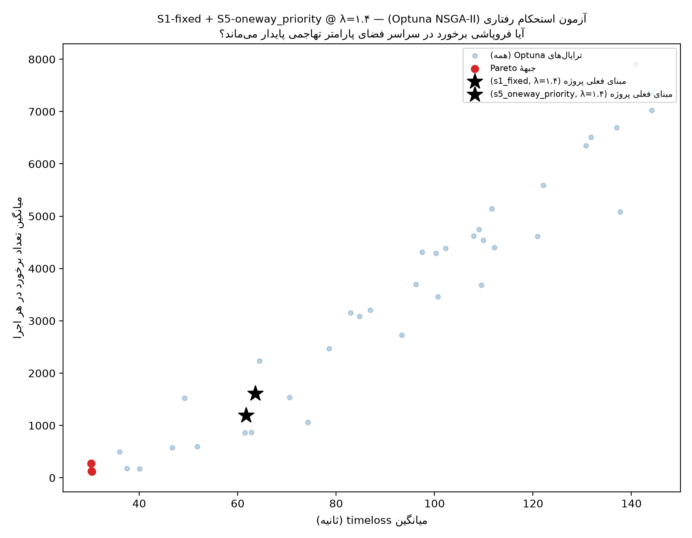{#fig-behavioral-pareto width=85%}

**پیامد برای مکانیزم ۲:** این یافته مکانیزم ۲ را رد نمی‌کند، آن را
**دقیق‌تر** می‌کند — «رفتار تهاجمی» یک برچسب کلی بود؛ شاهد این نشست نشان
می‌دهد سهم اصلی از میان ۶ پارامتر تهاجمی این مطالعه، تقریباً به‌طور
منحصر از `tau` می‌آید، نه از `jmIgnoreFoeProb`/`lcAssertive` (پارامترهای
فیلترینگ/بی‌اعتناییِ موتورسیکلت که در فرضیهٔ اولیهٔ گزارش مشکوک‌ترین به
نظر می‌رسیدند — همبستگی این دو با برخورد عملاً صفر است: ۰.۰۱ و ۰.۰۴).

**صداقت روش‌شناختی:** ۱ از ۴۰ ترایال (۲.۵٪) با خطای schema واقعی SUMO
شکست خورد (`impatience` یک وسیله از سقف مجاز ۱.۰ عبور کرد چون ضریب
جست‌وجو بدون قید روی مقدار پایه اعمال شده بود) — علت دقیق پیدا و در
اسکریپت رفع شد (سقف صریح برای `impatience`/`sigma`)، اما آن ترایال
بازاجرا نشد (هزینه/فایدهٔ ناچیز برای ۱ ترایال از ۴۰) و از تحلیل کنار
گذاشته شد (۳۹ ترایال تحلیل‌شده). **این هنوز calibration-to-groundtruth
نیست** — نتیجه می‌گوید فروپاشی برخورد به یک پارامتر خاص حساس است، نه اینکه
مقدار «درست» آن پارامتر چیست؛ آن پرسش هنوز به دادهٔ میدانی نیاز دارد
(بخش ۱۰).

**نتیجهٔ این تحلیل برای گزارش:** یافتهٔ «S1 بدتر از S0» را نباید به‌عنوان
حکمی قطعی دربارهٔ ارزش چراغ راهنمایی در دنیای واقعی خواند. این یافته می‌گوید:
**یک طرح چراغ سادهٔ Webster روی تقاضای زیراشباع، بدون هماهنگ‌سازی/کانالیزاسیون
تکمیلی و بدون کالیبراسیون رفتاری، می‌تواند اثر معکوس داشته باشد** — این
خودش یک یافتهٔ ارزشمند مهندسی است، نه ضعف مدل. به‌همین ترتیب، یافتهٔ S3
می‌گوید «میدان مفهومی ساده در تقاضای کم برنده نیست»، نه «مفهوم میدان رد
می‌شود»؛ و یافتهٔ S5 می‌گوید «افزودن کنترل مکمل به یک مداخلهٔ هندسی ناقص
می‌تواند بخشی از ضعفش را جبران کند، اما افزودن یک نقطهٔ تعارض هندسی جدید
بدون کنترل، آن را می‌شکند» — نه اینکه «ترکیب میدان با کنترل هوشمندانه ذاتاً
بی‌فایده است». و یافتهٔ S2+S4 می‌گوید «ترکیب مداخلات مستقل بدون کنترل
فعال روی گره‌های غیرهم‌پوشان می‌تواند سود تجمعی بدهد» — تاکنون قوی‌ترین
شاهد این مطالعه به نفع رویکرد «اول تعارض هندسی را حذف کن، کنترل فعال را
برای بعد از کالیبراسیون نگه دار».

## ۸. تحلیل SWOT سناریوها

برای هر ۶ سناریوی اصلی (S0 تا S5) و سناریوی ترکیبی S2+S4، نقاط زیر بر
مبنای **دادهٔ واقعی شبیه‌سازی‌شده** (کالیبره‌نشده) است — هیچ سناریویی
صرفاً مفهومی/بدون داده نیست.

| سناریو | نقاط قوت (Strengths) | نقاط ضعف (Weaknesses) | فرصت‌ها (Opportunities) | تهدیدها (Threats) |
|---|---|---|---|---|
| **S0 — وضع موجود** | کمترین/هم‌ردهٔ کمترین تأخیر در دادهٔ فعلی؛ بدون هزینهٔ اجرا؛ ادغام zipper رفتار روان در تقاضای متوسط | بدون کنترل رسمی، وابسته به مهارت/احتیاط راننده؛ رشد برخورد نمایی با λ (فاز ۳: تا ۸۰ برابر از λ=۰.۶ به ۱.۴)؛ فاقد حق‌تقدم شفاف برای گردش چپ | هزینهٔ صفر برای حفظ به‌عنوان مبنا؛ قابل‌بهبود با S4 (کانالیزاسیون سبک، بدون هزینهٔ کنترل فعال) | با رشد تقاضای شهر کرمان، نرخ برخورد می‌تواند به‌سرعت غیرقابل‌قبول شود |
| **S1 — چراغ (ثابت/actuated)** | حق‌تقدم رسمی و قابل‌پیش‌بینی؛ actuated خودتطبیق با نوسان تقاضا؛ زیرساخت آماده برای هماهنگ‌سازی آینده؛ فازبندی با روش مهندسی واقعی طراحی شده (سبز وزن‌دار وبستر + همه‌قرمز هندسی‌واقعی، نه فرض خام) | **داده‌محور، نه فرضی:** تأخیر بیشتر از S0 حتی با رفتار پیش‌فرض (بخش ۶) و حتی پس از بازطراحی واقعی فازبندی (بدون تغییر نتیجه)؛ برخورد بیشتر (اما این بخش عمدتاً محصول رفتار تهاجمیِ کالیبره‌نشده، نه خودِ چراغ) | با کالیبراسیون رفتاری و/یا هماهنگ‌سازی سیگنال می‌تواند نتیجه را معکوس کند؛ actuated واضحاً بهتر از ثابت | اجرای زودهنگام بدون کالیبراسیون رفتاری می‌تواند وضعیت ایمنی را عملاً بدتر کند |
| **S2 — حذف گردش چپ + دوربرگردان واقعی** | در λ=۰.۸ و λ=۱.۴ (تقاضای اوج) تأخیر تفاوت معنی‌داری با S0 ندارد؛ برخورد/صف در λ بالا جهت‌دار بهتر از S0؛ بدون کنترل فعال (بدون ریسک صف‌سازی S1)؛ حساسیت به فاصلهٔ دوربرگردان (۱۵۰/۲۵۰/۳۵۰م) ناچیز | در λ=۰.۶، ۱.۰ و ۱.۲ تأخیر اندکی (۷-۱۲٪) بیشتر از S0 — هزینهٔ واقعیِ مسیر اضافهٔ دوربرگردان، برخلاف نسخهٔ سادهٔ اول، اکنون در مدل لحاظ شده و مزیت را تعدیل کرده | نسخهٔ هندسی دقیق‌تر (انحناء واقعی، طول شتاب‌گیری کافی) می‌تواند هزینهٔ ثابت را کاهش دهد | داده‌های واقعی گردش چپ (نه فرض ۱۵٪) می‌تواند این نتیجه را در هر جهت تغییر دهد |
| **S3 — میدان نامتقارن (محدود/کامل)** | با افزایش تقاضا فاصله با S0 کوچک و غیرمعنادار می‌شود (الگوی متعارف میدان‌ها)؛ نسخهٔ full (دهانهٔ مرکزی باز) کمی بهتر از constrained در تأخیر متوسط/بالا | در تقاضای کم/متوسط (λ≤۱.۰) معنی‌دار بدتر از S0؛ برخورد بیشتر در هر دو نسخه (جهت‌دار، تا حد زیادی احتمالاً مصنوعِ سادگی هندسهٔ حلقهٔ تک‌خطه/بدون انحراف مهندسی‌شده در این نسخهٔ مفهومی)؛ گزینهٔ full مشروط به تأیید سازه‌ای خارج از حیطهٔ این مطالعه | طراحی هندسی دقیق (شعاع/انحراف/جزیرهٔ واقعی) می‌تواند به‌طور قابل‌توجهی نتیجه را بهبود دهد؛ اگر تأیید سازه‌ای بگیرد، دهانهٔ مرکزی مزیت محسوسی می‌دهد | بدون طراحی هندسی بهتر، ریسک ایمنی این نسخه ممکن است در دنیای واقعی هم تکرار شود؛ تأخیر در تأیید سازه‌ای، گزینهٔ full را عملاً غیرقابل‌اجرا نگه می‌دارد |
| **S4 — کانالیزاسیون** | کم‌هزینه‌ترین/کم‌ریسک‌ترین مداخله؛ بدون نیاز به گرهٔ جدید یا تأیید سازه‌ای؛ هیچ تفاوت آماری معنی‌داری با S0 در هیچ معیار (نه بهتر نه بدتر، در همهٔ ۵ λ) | بدون بهبود قابل‌سنجش در این پیاده‌سازی؛ به‌تنهایی گردش چپ غیررسمی را حذف نمی‌کند | می‌تواند گام میانی سریع/کم‌ریسک باشد، یا در ترکیب با S2 (که تعارض چپ را حذف می‌کند) اثر تجمعی بدهد — رجوع به گام‌های بعدی | ممکن است فقط علائم را بپوشاند، نه علت ریشه‌ای (نبود حق‌تقدم رسمی برای گردش چپ) |
| **S5 — ترکیبی (متردهنده/بای‌پس)** | متردهنده نسبت به حلقهٔ خام S3-محدود در λ=۱.۴ واقعاً بهتر می‌شود (حداکثر صف ۱۰۶ در برابر ۱۴۷ متر) و پایدارتر است (بدترین seed فقط ۴۴ ثانیه/۴۸۳ برخورد)؛ سیکل ۲۰ ثانیه‌اش با جست‌وجوی تجربی تأیید شد، نه صرفاً فرض؛ زیرساخت حلقه در هر چهار گزینه از S3 به‌اشتراک گرفته می‌شود | بای‌پس در **هر سه** طرح کنترل آزموده‌شده شکست خورد: بدون‌قیدوشرط (اولویت ۸۰) حتی پس از رفع مستند تداخل هندسی‌اش، ریسک دنبالهٔ شدید داشت (۱ از ۱۰ seed، ۶۰۰۹ برخورد)؛ یالدهنده (اولویت ۳۰، بدون pass) آن را به ضعف یکنواخت و معنی‌دار در هر ۱۰ seed تبدیل کرد (λ=۱.۴: ۱۵۲۶.۵ برخورد میانگین)؛ چراغ راهنمایی واقعی (طراحی‌شده با src/10_signal_design.py) **بدترین** بود — λ=۱.۴: ۳۲۵۷.۶ برخورد، بیشتر حتی از بدترین حالت S1؛ هیچ‌کدام به سطح S0 نمی‌رسد | متردهنده با کالیبراسیون رفتاری می‌تواند به S0 نزدیک‌تر شود؛ برای بای‌پس، سه رفع رد شده (هندسه، حق‌تقدم، چراغ) نشان داد گام بعدیِ واقعی یا جداسازی کامل ترازی است یا کالیبراسیون رفتاری برای سنجش پایداری این نتیجه | بدون جداسازی ترازی، بای‌پس در دنیای واقعی می‌تواند فروپاشی نادر، ازدحام مزمن، یا (با چراغ) خطر آزادسازی دوره‌ای صف را بازتولید کند — هیچ تنظیم کنترلیِ هم‌سطحی این محل را ایمن نمی‌کند |
| **S2+S4 ترکیبی** | **بهترین نتیجهٔ ایمنی کل این مطالعه:** برخورد ۸۰-۸۴٪ کمتر از S0 در λ≥۱.۰ (همه معنی‌دار، اندازهٔ اثر بزرگ)؛ حداکثر صف تا ۷۱٪ کمتر در λ=۱.۴؛ در λ=۱.۴ تأخیر هم جهت‌دار بهتر از S0 (نه بدتر)؛ هیچ کد تازه‌ای لازم نبود — فقط فراخوانی دو تابع موجود S2/S4 روی یک شبکه؛ بدون کنترل فعال، بدون ریسک صف‌سازی S1 | تأخیر در λ=۰.۶ و ۱.۰ اندکی (۶-۶٪) بدتر، معنی‌دار؛ همهٔ محدودیت‌های صریح S2 (سهم فرضی دوربرگردان) و S4 (بدون اثر مدل پارک حاشیه‌ای) را به ارث می‌برد؛ فرض «جمع‌شدنی بودن» دو اصلاح با داده تأیید شد اما پیش از این آزمایش تضمین‌شده نبود | نامزد طبیعی و فوریِ گام اجرایی بعدی — کم‌هزینه، بدون تأیید سازه‌ای، بدون کنترل فعال؛ الگوی «ترکیب مداخلات مستقل روی گره‌های غیرهم‌پوشان» می‌تواند به سناریوهای دیگر هم تعمیم یابد | مشروط به کالیبراسیون رفتاری واقعی (بخش ۱۰) پیش از هر توصیهٔ اجرایی قطعی؛ داده‌های واقعی گردش چپ/راست می‌تواند اندازهٔ این سود را تغییر دهد |

## ۹. نتیجه‌گیری اولیه و رتبه‌بندی مقدماتی

::: {.callout-warning}
## این یک رتبه‌بندی نهایی نیست
هر ۶ سناریوی اصلی به‌علاوهٔ سناریوی ترکیبی S2+S4 اکنون ساخته، شبیه‌سازی و
تحلیل کیفی/SWOT شده‌اند (رجوع به بخش‌های ۷ و ۸). رتبه‌بندی زیر **صرفاً بر
مبنای دادهٔ موجود** است و بدون کالیبراسیون واقعی (بخش ۱۰)، نباید مبنای
تصمیم اجرایی قرار گیرد؛ S3 و S5 هرکدام به یک دور بازبینی هندسی/کنترلی
جدی‌تر پیش از قضاوت نهایی نیاز دارند (بخش ۱۲).
:::

بر مبنای شواهد فعلی، رتبه‌بندی مقدماتی (بهترین به بدترین، بر مبنای ترکیب
تأخیر+ایمنی در سراسر بازهٔ λ، با تأکید ویژه بر رفتار در تقاضای اوج λ=۱.۴):

1. **S2+S4 ترکیبی — بهترین نتیجهٔ ایمنی کل این مطالعه، در رأس رتبه‌بندی.**
   کاهش ۸۰-۸۴٪ برخورد نسبت به S0 در λ≥۱.۰ (همه معنی‌دار، اندازهٔ اثر
   بزرگ)، حداکثر صف تا ۷۱٪ کمتر، و تأخیر در λ=۱.۴ جهت‌دار **بهتر** از S0
   (نه بدتر) — بدون هیچ کنترل فعال یا کد تازه (فقط ترکیب دو اصلاح موجود
   S2/S4). تنها هزینه: تأخیر اندکی (۶-۶٪) بدتر در λ=۰.۶ و ۱.۰. این ترکیب
   مستقیماً از مشاهدهٔ تکرارشدهٔ این مطالعه («حذف تعارض هندسی بدون کنترل
   فعال، دست‌کم هم‌تراز و گاه بهتر است») ساخته شد و آن مشاهده را با
   قوی‌ترین شاهد ممکن تأیید کرد.
2. **S0 (وضع موجود) و S4 (کانالیزاسیون) — عملاً هم‌رده، ردهٔ دوم.**
   S4 در هیچ معیاری تفاوت آماری معنی‌داری با S0 نشان نداد؛ یعنی این
   کم‌ریسک‌ترین مداخلهٔ منفرد، دست‌کم بی‌ضرر است و هزینهٔ اجرای پایینی دارد.
3. **S2 (حذف گردش چپ + دوربرگردان واقعی، منفرد) — نزدیک پشت سر، با برتری
   واقعی در تقاضای اوج.** با لحاظ‌کردن هزینهٔ واقعی مسیر دوربرگردان (که در
   نسخهٔ اول این گزارش لحاظ نشده بود)، S2 در تقاضای پایین/میانی اندکی
   (۷-۱۲٪) بدتر از S0 شد، اما دقیقاً در λ=۱.۴ — سطح تقاضایی که برای آیندهٔ
   این تقاطع بیشترین نگرانی را دارد — همچنان **بدون تفاوت معنی‌دار** با S0
   می‌ماند و در ایمنی جهت‌دار بهتر است. حساسیت به فاصلهٔ دوربرگردان
   (۱۵۰/۲۵۰/۳۵۰ متر) ناچیز بود.
4. **S3 (میدان نامتقارن، هر دو گزینه) و S5-متردهنده — نیازمند طراحی هندسی/کنترلی
   دقیق‌تر پیش از قضاوت نهایی، اما با شواهد نویدبخش.** S3 در تقاضای
   پایین/میانی معنی‌دار بدتر از S0 است (هم تأخیر و هم جهت‌دار در برخورد)،
   اما فاصله با افزایش تقاضا به‌سرعت کوچک می‌شود — الگوی متعارف میدان‌ها.
   **S5-متردهنده** یک قدم فراتر می‌رود: نسبت به حلقهٔ خام S3-محدود، در
   λ=۱.۴ واقعاً **بهتر** می‌شود (حداکثر صف ۱۰۶ در برابر ۱۴۷ متر، و پایدارتر
   — بدترین seed فقط ۴۴ ثانیه/۴۸۳ برخورد) — شاهد مستقیم اینکه یک چراغ
   متردهندهٔ حتی تنظیم‌نشده می‌تواند بخشی از ضعف ذاتی یک میدان کوچک را در
   تقاضای اوج جبران کند. هر دو این نسخه‌های مفهومی (حلقهٔ تک‌خطهٔ بدون
   انحراف مهندسی‌شده) به‌احتمال زیاد بدترین حالت ممکن برای این مفاهیم را
   نشان می‌دهند؛ نمی‌توان دربارهٔ ارزش واقعی «میدان» یا «میدان+متردهنده» با
   این داده قضاوت قطعی کرد.
5. **S1 (چراغ، هر دو حالت، بازطراحی‌شده) و S5-بای‌پس (هر سه طرح کنترل)، به‌شکل
   فعلی — توصیه نمی‌شوند.** آزمون تشخیصی بخش ۶ نشان داد S1 حتی با رفتار
   کالیبره‌شدهٔ فرضی همچنان بدتر از S0 خواهد ماند (مکانیزم اصلی تأخیر،
   طراحی سیگنال است، نه رفتار)؛ بازطراحی واقعی فازبندی (سبز وزن‌دار وبستر
   + همه‌قرمز هندسی‌واقعی، `src/10_signal_design.py`) این نتیجه را تغییر
   نداد — اگر چیزی، در λ=۱.۴ کمی بدتر شد (تأخیر ۶۳.۶ ثانیه، ۱۶۰۹.۷ برخورد
   برای نسخهٔ ثابت). نسخهٔ actuated به‌وضوح بر زمان‌ثابت ترجیح دارد.
   **S5-بای‌پس** سه دور اصلاح را آزمود و در هر سه شکست خورد: با حق‌تقدم
   بدون‌قیدوشرط، حتی پس از رفع مستند و موفقِ تداخل هندسی‌اش (هشدار
   netconvert کاملاً حذف شد)، بهبود قابل‌اتکایی نشان نداد و ریسک دنبالهٔ
   شدید داشت (۹ از ۱۰ seed حول ~۴۲ ثانیه، اما یک seed با ۲۴۲ ثانیه/۶۰۰۹
   برخورد در یک اجرا). با حق‌تقدم عادی/یالدهنده (اولویت پایین‌تر از حلقه،
   بدون pass — آزمون مستقیم فرضیهٔ «حذف حق‌تقدم بدون‌قیدوشرط کمک می‌کند»)،
   نتیجه برعکس شد: برخورد در λ=۱.۴ به ۱۵۲۶.۵ در هر اجرا رسید، این‌بار
   به‌طور یکنواخت در هر ۱۰ seed (نه یک فروپاشی نادر) و از نظر آماری کاملاً
   معنی‌دار. **سومین آزمون — یک چراغ راهنمایی واقعی روی همان گره، طراحی‌شده
   با همان روش S1 — نه‌تنها کمک نکرد، بدترین نتیجهٔ سه‌گانه شد:** λ=۱.۴،
   تأخیر ۸۷.۸ ثانیه و ۳۲۵۷.۶ برخورد در هر اجرا — بیشتر حتی از بدترین حالت
   خودِ S1. این نشان می‌دهد نه رفع هندسی، نه تنظیم حق‌تقدم، و نه چراغ
   راهنمایی، هیچ‌کدام برای این سناریو کافی نیستند؛ ریشهٔ اصلی، وجود خودِ
   نقطهٔ تعارض است، صرف‌نظر از شکل کنترلش — رجوع به بخش ۷ (مکانیزم ۵) برای
   تحلیل کامل.

**توصیهٔ فرآیندی:** **S2+S4 ترکیبی** اکنون قوی‌ترین نامزد برای گام اجرایی
بعدی است — کم‌هزینه، بدون کنترل فعال، و با بهترین شاهد ایمنی کل مطالعه؛
S4 (کم‌ریسک، بی‌اثر منفی) و S2 منفرد (نویدبخش در تقاضای اوج) پشتیبان‌های
طبیعی آن‌اند. همهٔ این توصیه‌ها **مشروط به کالیبراسیون رفتاری واقعی**اند
(چون بخش ۶ نشان داد نتیجهٔ ایمنی به این پارامترها بسیار حساس است). S3 و
S5-متردهنده نیازمند یک دور طراحی هندسی/کنترلی جدی‌تر (نه صرفاً حلقهٔ
مفهومی این نسخه یا سیکل پیش‌فرض netconvert) پیش از مقایسهٔ منصفانه‌اند؛
S5-بای‌پس اکنون نیازمند کنترل فعال واقعی (نه تنظیم هندسه/حق‌تقدم) است تا
از ردهٔ S1 خارج شود.
تحلیل کیفی/SWOT تفصیلی S5 و تحلیل حساسیت سراسری، گام‌های باقی‌ماندهٔ فاز ۴
هستند (بخش ۱۲).

## ۱۰. برنامهٔ کالیبراسیون و اعتبارسنجی

بخشی از ارزش این گزارش، شفاف‌سازی دربارهٔ داده‌ای است که نداریم. آزمون
تشخیصی بخش ۶ این اولویت‌بندی را تأیید کرد: **کالیبراسیون رفتاری (سطر سوم
جدول) اکنون هم‌ردهٔ شمارش حرکات گردشی، اولویت بحرانی است.**

| نیاز داده | روش برداشت پیشنهادی | هزینه/زمان | اولویت |
|---|---|---|---|
| شمارش حرکات گردشی ۱۵ دقیقه‌ای، ۲ اوج صبح و عصر | فیلم‌برداری پهپاد/دوربین مرتفع + شمارش خودکار (YOLO + ByteTrack) | متوسط | **بحرانی** |
| ترکیب ناوگان و سهم موتورسیکلت | از همان فیلم | کم | بالا |
| **پارامترهای رفتاری، به‌ویژه `tau` (فاصلهٔ زمانی پیرو واقعی در صف)** | استخراج trajectory از فیلم (ردیابی خودرو) + برازش با Optuna/GA | متوسط | **بحرانی (تأییدشده با آزمون تشخیصی فاز ۴؛ آزمون استحکام بخش ۷ نشان داد سهم اصلی از میان ۶ پارامتر، تقریباً منحصراً از `tau` می‌آید — این سطر جدول اکنون یک هدف مشخص و مقیاس‌پذیر دارد، نه یک فهرست کلی)** |
| طول صف و زمان تخلیه | از همان فیلم | کم | بالا |
| جریان اشباع | برداشت میدانی استاندارد | کم | متوسط |
| زمان سفر مسیر | خودروی شناور با GPS، ۶–۱۰ دور در هر اوج | کم | بالا |
| OD ناحیه‌ای | داده تاکسی اینترنتی/داده موبایل/مصاحبه | زیاد | نسخه ۲ |

**معیارهای پذیرش:** GEH < 5 برای ≥۸۵٪ از حرکات، خطای زمان سفر <۱۵٪، انطباق
کیفی الگوی صف. اعتبارسنجی روی یک دورهٔ کنارگذاشته‌شده (اوج روز دیگر) انجام
می‌شود.

## ۱۱. محدودیت‌ها

- **این گزارش مدل کالیبره‌نشده است** (رجوع به بنر ابتدای گزارش) — هیچ عدد
  مطلق (ثانیه، تعداد برخورد) نباید به‌عنوان پیش‌بینی واقعیت خوانده شود؛ فقط
  جهت و بزرگی نسبی تفاوت‌ها معتبر است.
- **هر ۶ سناریوی اصلی + سناریوی ترکیبی S2+S4 ساخته، شبیه‌سازی و تحلیل
  کیفی/SWOT شده‌اند** (بخش‌های ۷ و ۸)، اما نتیجه‌گیری بخش ۹ همچنان مقدماتی
  و مشروط به کالیبراسیون واقعی است — و نه S3 و نه S5-متردهنده (هر دو روی
  همان حلقهٔ مفهومی S3 ساخته شده‌اند) با هندسه/کنترل نهایی‌شده آزموده
  نشده‌اند.
- **S2+S4 ترکیبی**، با اینکه بهترین نتیجهٔ ایمنی این مطالعه را داد، دو
  فرض به ارث می‌برد که خودش نساخته: سهم فرضی ۱۵٪ دوربرگردان (از S2) و عدم
  لحاظ اثر پارک حاشیه‌ای (از S4). همچنین فرض «جمع‌شدنی بودن» اثر دو اصلاح
  فقط برای این جفت خاص (S2+S4) با داده تأیید شد؛ تعمیم به ترکیب‌های دیگر
  (مثلاً S2+S1) از پیش تضمین‌شده نیست.
- **S3 (هر دو گزینه) یک پیاده‌سازی هندسی به‌عمد ساده‌شده است، هرچند بهبودیافته:**
  حلقهٔ گردشی با شکل کمانی (نه خط راست نسخهٔ اول) میان ۴ نقطهٔ واقعی رسم شده،
  اما هنوز یک دایرهٔ مهندسی‌شده با شعاع/انحراف/جزیرهٔ قطره‌ای طراحی‌شده
  نیست. آزمایش تک‌خطه در برابر دوخطه (رجوع به `scenarios/S3_roundabout/README.md`)
  نشان داد افزایش خط، برخورد را بیشتر می‌کند نه کمتر — یافته‌ای که برای
  طراحی هندسی دقیق‌تر آینده باید در نظر گرفته شود.
- **S5 (هر چهار نسخه) همچنان مفهومی/اکتشافی است، هرچند سه دور بازبینی
  دیده:** چراغ متردهندهٔ `metering` سیکل ۲۰ثانیه‌اش را با یک جست‌وجوی
  تجربی سبک (۳ seed، نه بهینه‌سازی رسمی) تأیید کرد. بای‌پس در **سه** طرح
  کنترل آزموده و در هر سه رد شد: `oneway_priority` (بدون‌قیدوشرط) تداخل
  هندسی مستندش کاملاً رفع شد اما بهبود نداد و ریسک دنبالهٔ جدی نشان داد؛
  `oneway_yield` (حق‌تقدم عادی، آزمون مستقیم فرضیهٔ رفتاری) نه‌تنها بهبود
  نداد بلکه ریسک دنبالهٔ نادر را به ضعف یکنواخت و معنی‌دار در هر ۱۰ seed
  تبدیل کرد؛ `oneway_signal` (چراغ راهنمایی واقعی، طراحی‌شده با
  `src/10_signal_design.py`) بدترین بود — نتیجه‌اش، برخلاف دو تلاش قبلی،
  در هر ۱۰ seed یکنواخت بد است، نه یک ریسک دنبالهٔ نادر. این سه نتیجهٔ
  متوالی نشان می‌دهد مشکل بای‌پس نه با تنظیم هندسه، نه با تنظیم طرح
  حق‌تقدم، و نه با کنترل فعال هم‌سطح قابل‌حل است — جداسازی کامل ترازی یا
  کالیبراسیون رفتاری برای سنجش پایداری این نتیجه، گام بعدی واقعی‌اند.
- **S2 اکنون هزینهٔ مسیر دوربرگردان را لحاظ می‌کند** (رفع محدودیت نسخهٔ
  قبلی این گزارش)، اما همچنان یک تقریب است: سهم ترافیک ارجاع‌داده‌شده به
  دوربرگردان (۱۵٪) از `turn_ratio_baseline.left` گرفته شده، نه شمارش واقعی؛
  و شکل حلقهٔ ورود/خروج دوربرگردان مهندسی کامل ندارد.
- **طراحی چراغ S1، با اینکه از این نشست دیگر روی سبز/همه‌قرمز واقعی
  (وبستر + هندسهٔ هر گره) بنا می‌شود، همچنان دو ساده‌سازی صریح دارد:**
  اول، گره‌های ادغام همچنان مستقل چراغ‌دار شده‌اند نه یک تقاطع کلاسیک
  واحد (رجوع به بخش ۴)؛ هماهنگ‌سازی (progression/offset) بین این گره‌ها
  مدل نشده — می‌تواند بخشی از اثر منفی مشاهده‌شده را جبران کند. دوم، وزن
  سبز هر فاز از تعداد اتصال‌های آن فاز تخمین زده می‌شود (پروکسی ظرفیت
  نسبی)، نه شمارش واقعی حرکت‌به‌حرکت — دقیقاً همان دادهٔ اولویت‌دار
  برنامهٔ کالیبراسیون (بخش ۱۰).
- شعاع گردش رمپ‌ها، عرض دهانه‌های پل، و تقاضای پایه هنوز از برآورد چشمی/
  قضاوت مهندسی‌اند، نه اندازه‌گیری میدانی (رجوع به جدول کامل مفروضات در
  `config/assumptions.yml`).
- فاصلهٔ اطمینان تعداد برخورد با روش t استاندارد (مناسب داده‌های پیوسته)
  محاسبه شده؛ برای شمارش رویداد نادر، مدل پواسون/دوجمله‌ای منفی دقیق‌تر است.
  این به‌ویژه برای S3 و S5-بای‌پس مهم است که واریانس برخورد در آن‌ها
  بالاست (نمونهٔ ۱۰ seed چندین مقایسهٔ جهت‌دار قوی را غیرمعنادار آماری
  نشان داد؛ S5-بای‌پس در λ=۱.۴ نمونهٔ عینی این مشکل است — یک seed از ۱۰
  به‌تنهایی میانگین را از حدود ۴۲ ثانیه به ۶۱.۷ ثانیه می‌کشد).
- گزارش انگلیسی (`report-en.qmd`) در همین نشست با محتوای فاز ۴ هم‌گام شد؛
  چون هر دو گزارش از همان جدول‌های `outputs/tables/*.csv` می‌خوانند، اعداد
  دو زبان همیشه دقیقاً یکسان می‌مانند (اصل طلایی «یک‌بار محاسبه، چندبار
  گزارش»)، اما ویرایش‌های بعدی متن فارسی باید دستی به نسخهٔ انگلیسی هم
  منتقل شوند — بخشی که این نشست هم بلافاصله بعد از این ویرایش‌ها انجام داد.

## ۱۲. گام‌های بعدی (فاز ۴، ادامه)

1. **جداسازی کامل ترازی برای بای‌پس S5 — طیف کنترل هم‌سطح اکنون کامل
   امتحان و رد شده است.** سه تلاش پیاپی، هر سه در این پروژه، رد شدند: رفع
   صرفاً هندسی (شعاع تقاطع) هشدار netconvert را حل کرد اما بهبود واقعی
   نداد؛ تبدیل حق‌تقدم بدون‌قیدوشرط به حق‌تقدم عادی (`oneway_yield`) هم
   کمکی نکرد — ریسک دنبالهٔ نادر را به ضعف یکنواخت تبدیل کرد؛ و اکنون یک
   **چراغ راهنمایی واقعی** (`oneway_signal`، طراحی‌شده با همان روش مهندسی
   S1) نه‌تنها کمک نکرد بلکه بدترین نتیجهٔ کل این مطالعه را داد (بخش ۷،
   مکانیزم ۵). گام بعدی واقعی دیگر «کدام کنترل هم‌سطح» نیست — فقط دو گزینه
   می‌ماند: (الف) جداسازی کامل ترازی (رمپ/زیرگذر اختصاصی برای این حرکت)،
   یا (ب) کالیبراسیون رفتاری برای سنجش این‌که آیا نتیجهٔ منفی هر سه تلاش،
   محصول رفتار تهاجمی کالیبره‌نشده است یا یک ضعف واقعی هندسی/کنترلی —
   رجوع به بند ۲.
2. **بخش استحکام رفتاری انجام شد؛ بخش ارزش واقعی هنوز باقی است.** آزمون
   Optuna بخش ۷ (مکانیزم ۷) نشان داد از میان ۶ پارامتر تهاجمی، تقریباً
   تمام سهم فروپاشی برخورد S1/S5-بای‌پس از `tau` می‌آید، نه از پارامترهای
   فیلترینگ/بی‌اعتنایی که مشکوک‌ترین به نظر می‌رسیدند. این پرسش را که
   «آیا شکست‌ها واقعاً هندسی/کنترلی‌اند یا محصول رفتار تهاجمی‌اند» تا حد
   زیادی پاسخ داد (پاسخ: تا حد زیادی رفتاری، و به‌طور خاص `tau`). **آنچه
   هنوز باز است:** کدام مقدار `tau` برای ناوگان کرمان *درست* است — این
   پرسش صرفاً با شمارش میدانی سرعت/فاصلهٔ پیرو (بخش ۱۰) پاسخ‌پذیر است، نه
   با جست‌وجوی بیشتر پارامتر. تا آن داده، تصمیم به تغییر مقدار پایهٔ
   `tau` در `config/vtypes.yml` (و اجرای مجدد سناریوهای اصلی با آن) یک
   تصمیم مدل‌سازی است که باید صریحاً با کاربر مطرح شود، نه یک‌طرفه اعمال
   شود — نتیجهٔ Optuna فقط می‌گوید *کجا* حساسیت هست، نه این‌که مقدار
   فعلی *غلط* است.
3. **طراحی هندسی دقیق‌تر S3:** جایگزینی حلقهٔ تک‌خطهٔ کمانی فعلی با یک
   میدان واقعی (شعاع/انحراف/جزیرهٔ قطره‌ای مهندسی‌شده) — نتیجهٔ فعلی S3
   همچنان به‌احتمال زیاد بدبینانه‌تر از یک طرح مهندسی‌شدهٔ واقعی است. چون
   S5-متردهنده روی همین حلقه ساخته شده، این کار به‌طور خودکار S5 را هم
   به‌روز می‌کند. **یافتهٔ تازهٔ همین نشست** (بخش ۲.۲): جزیرهٔ سه‌دهانه‌ای
   بستهٔ واقعی زیر پل از پیش هندسهٔ یک جزیرهٔ مرکزی میدان را دارد — نقطهٔ
   شروع طبیعی برای این طراحی دقیق‌تر، به‌جای یک حلقهٔ کاملاً تخمینی.
4. تحلیل حساسیت سراسری (Sobol/فاکتوریل) روی λ، سهم گردش چپ، سهم موتورسیکلت،
   tau، و شعاع گردش — اکنون شامل S2+S4 هم می‌شود تا معلوم شود سود ایمنی
   آن در برابر تقاضای اوج/سهم گردش‌ها چقدر پایدار می‌ماند.
5. جایگزینی فاصلهٔ اطمینان t-محور برای شمارش برخورد با یک مدل رویداد نادر
   (پواسون/دوجمله‌ای منفی) — S5-بای‌پس نمونهٔ تازه و ملموسی از این نیاز
   نشان داد (بخش ۱۱).
6. بررسی ترکیب‌های بیشتر (مثلاً S2+S4+متردهنده) اکنون که ثابت شد مداخلات
   مستقل روی گره‌های غیرهم‌پوشان می‌توانند اثر تجمعی بدهند (بخش ۷، مکانیزم ۶).
