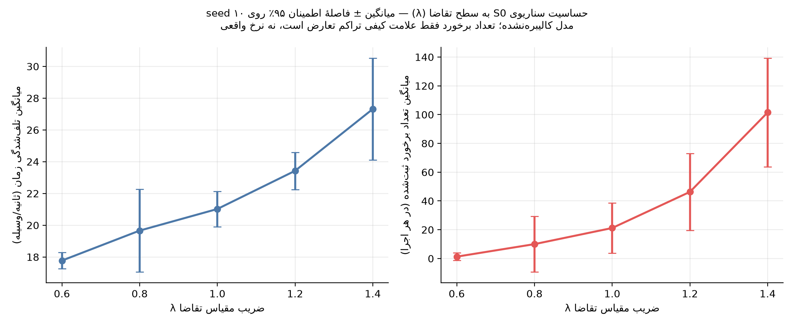

::: {.callout-important}
## هشدار — مدل کالیبره‌نشده
این گزارش نسخهٔ **فاز ۳** است. هندسهٔ پایه هنوز از OSM است (با اصلاحات
مبتنی بر تصویر روی خط عرشه، نوع تقاطع‌های ادغام، و ساختار پایه‌های پل) و
تقاضای پایه کاملاً **فرضی** (حدس مهندسی، نه برداشت میدانی) باقی مانده است. از
این نسخه به بعد، طبق قاعدهٔ سخت ۵ پروژه، هر عدد گزارش‌شده **میانگین ± فاصلهٔ
اطمینان ۹۵٪ روی حداقل ۱۰ seed** است — اما چون هنوز فقط سناریوی S0 (وضع موجود)
ساخته شده، **هیچ مقایسهٔ سناریویی** (وضع موجود در برابر گزینه‌های اصلاحی) در
این گزارش وجود ندارد؛ آن در فاز ۴ می‌آید. آنچه اینجا هست، حساسیت خودِ وضع
موجود به سطح تقاضاست.
:::

## ۱. هدف این نسخه

هدف فاز ۱، طبق نقشهٔ راه پروژه (`CLAUDE.md`)، ساخت یک خط لولهٔ **کامل و
end-to-end** بود — از دادهٔ خام OSM تا گزارش منتشرشده — حتی با هندسه و تقاضای
خام. فاز ۲ همان خط لوله را با هندسهٔ حیاتی (خط عرشه، نوع تقاطع‌های ادغام،
ساختار پایه‌های پل) و ترکیب ناوگان نزدیک‌تر به شواهد تصویری/قضاوت مهندسی کرد.
فاز ۳ (این نسخه) زیرساخت **چند-λ × چند-seed** را طبق قاعدهٔ سخت ۵ پروژه اضافه
می‌کند و حساسیت وضع موجود (S0) به سطح تقاضا را می‌سنجد — پیش‌نیاز آماری لازم
برای مقایسهٔ معنادار سناریوها در فاز ۴.

## ۲. ساخت شبکه و راستی‌آزمایی جدایی تراز

شبکه از OpenStreetMap (Overpass API، bbox حول تقاطع زیرپل سیدی) با `netconvert`
ساخته شد. جدایی تراز عرشهٔ پل (بزرگراه امام‌رضا، `bridge=yes layer=1`) از شبکهٔ
هم‌سطح زیرین (جادهٔ سیدی/بلوار شهید سلیمانی) به‌صورت **بصری بررسی و تأیید** شد
(شکل @fig-layer-check) — نقطه‌ای که طبق `CLAUDE.md` مهم‌ترین ریسک خطای مدل است.

{#fig-layer-check width=85%}

## ۳. تقاضا: روش jtrrouter

طبق توجیه روش‌شناسی `CLAUDE.md`، برای یک تقاطع منفرد، حجم ورودی هر پا + نسبت
گردش‌ها روشی به‌مراتب کم‌نیازتر از ماتریس OD کامل است. تقاضای این نسخه کاملاً
فرضی است (رجوع به `config/assumptions.yml` بخش‌های `demand_baseline_phase1` و
`traffic_control.turn_ratio_baseline`):

| پا | حجم ورودی فرضی (وسیله/ساعت) |
|---|---|
| غرب (عرشهٔ پل) | ۸۰۰ |
| شرق (عرشهٔ پل) | ۸۰۰ |
| شمال (جادهٔ سیدی) | ۵۰۰ |
| جنوب (بلوار شهید سلیمانی) | ۵۰۰ |

## ۴. وفاداری هندسی و ترکیب ناوگان (فاز ۲)

**اصلاحات هندسی مبتنی بر تصویر** (اعمال‌شده روی plain-XML با
`src/02_patch_geometry.py`، طبق قاعدهٔ سخت ۲ — بدون هیچ ویرایش دستی netedit):

- **تعداد خط عرشهٔ پل:** OSM آن را ۲ خط در هر جهت ثبت کرده بود؛ بازبینی دقیق‌تر
  `2025_zoom.png` (ردیف‌های سه‌تایی خودرو) با اطمینان بالا ۳ خط را نشان می‌داد
  — اصلاح شد. رجوع به `config/assumptions.yml -> bridge_geometry.deck_lanes_per_direction`.
- **نوع تقاطع نقاط ادغام زیر پل:** ۹ تقاطع ادغام (۲ ورودی/۱ خروجی) در میدانچهٔ
  ویوینگ از `priority` پیش‌فرض netconvert به `zipper` تغییر یافت — برای
  بازنمایی رفتار واقعی «هر که زودتر رسید» در نبود کانالیزاسیون/چراغ (رجوع به
  `traffic_control.weave_merge_junction_model`).

**یافتهٔ کلیدی هندسی — ساختار ۷دهانه‌ای پایه‌های پل:** بازرسی دقیق کاربر از
`2012.png` (زمانی که سازهٔ پل هنوز عریان و پایه‌ها کاملاً قابل‌مشاهده بودند)
نشان داد زیر پل، در امتداد محور شرقی-غربی، به ۷ دهانه تقسیم می‌شود: ۳ دهانه در
غرب + ۱ دهانهٔ مرکزی + ۳ دهانه در شرق (شکل @fig-sketch). از سه دهانهٔ هر سمت،
فقط دهانهٔ **مجاور مرکز** به روی ترافیک باز است و محل واقعی عبور/گردش
خودروهاست؛ دو دهانهٔ انتهایی هر سمت کاملاً بسته و بخشی از بدنهٔ سازه‌ای پل‌اند
(نه فضای خالی قابل‌استفاده)، و دهانهٔ مرکزی در وضع موجود عمداً بسته نگه داشته
شده. این یعنی میدانچهٔ ویوینگ زیر پل، برخلاف تصور اولیهٔ فاز ۰، یک فضای باز
پیوسته نیست — دقیقاً **دو گلوگاه گسسته** (دهانهٔ باز غربی و دهانهٔ باز شرقی) با
یک بستر بستهٔ سازه‌ای میان‌شان است؛ رفتار شبه‌میدانی مشاهده‌شده از وِیوینگ
خودروها بین همین دو گلوگاه ناشی می‌شود. **پیامد سناریو:** باز کردن دهانهٔ
مرکزی (منوط به تأیید ظرفیت باربری سازه توسط مهندس سازه — خارج از محدودهٔ این
مطالعهٔ ترافیکی) یک گزینهٔ صریح برای فاز ۴ است که مسیر سوم عبوری زیر پل را
می‌گشاید. رجوع به `config/assumptions.yml -> bridge_geometry.span_structure`.

{#fig-sketch width=90%}

**ترکیب ناوگان و رفتار** (`config/vtypes.yml`، همه با فلگ `sensitivity: true`
در `assumptions.yml`):

```{python}
#| label: tbl-fleet
#| tbl-cap: "ترکیب ناوگان فرضی (قضاوت مهندسی — اولویت #۱ برنامهٔ کالیبراسیون)"
import yaml
from IPython.display import Markdown
vcfg = yaml.safe_load(open("../config/vtypes.yml", encoding="utf-8"))
names_fa = {"passenger": "سواری", "motorcycle": "موتورسیکلت", "taxi": "تاکسی",
            "pickup": "وانت", "bus": "اتوبوس", "truck_light": "کامیونت"}
rows = [{"دسته": names_fa[k], "سهم": f"{v['share']*100:.0f}٪"} for k, v in vcfg["fleet_composition"].items()]
import pandas as pd
Markdown(pd.DataFrame(rows).to_markdown(index=False))
```

مدل **sublane** با `--lateral-resolution 0.8` فعال شد تا فیلترینگ موتورسیکلت
بین خطوط قابل بازنمایی باشد؛ پارامترهای `tau`, `minGap`, `sigma`,
`impatience`, `jmIgnoreFoeProb`, `lcAssertive` برای همهٔ رده‌ها تهاجمی‌تر از
پیش‌فرض SUMO تنظیم شدند (بیشترین تهاجمی‌بودن برای موتورسیکلت).

::: {.callout-warning}
## یافتهٔ کیفی قابل‌توجه
سناریوی S0 با `collision.action=warn` (بدون حذف خودرو پس از برخورد) اجرا
می‌شود تا برخوردها در آمار ثبت شوند ولی شبیه‌سازی متوقف نشود. روند کامل تعداد
برخورد در برابر سطح تقاضا (میانگین روی ۱۰ seed برای هر سطح) در بخش ۶
(«تحلیل حساسیت به سطح تقاضا») ارائه شده؛ در همین‌جا کافی است بگوییم رشد آن با
افزایش تقاضا به‌مراتب تندتر از رشد تأخیر است — نشانه‌ای کیفی از تراکم بالای
تعارض در نبود کانالیزاسیون که با انگیزهٔ اصلی این مطالعه همخوان است. شاخص‌های
ایمنی جانشین (TTC/DRAC/PET) به‌صورت آماری در فاز ۴ گزارش می‌شوند.
:::

## ۵. نتیجهٔ اجرای مبنا (λ=۱.۰، میانگین ۱۰ seed)

```{python}
#| label: tbl-kpi
#| tbl-cap: "خلاصهٔ KPI به تفکیک پا — سناریوی S0، λ=۱.۰، میانگین روی ۱۰ seed"
import pandas as pd
df = pd.read_csv("../outputs/tables/s0_kpi_summary.csv")
approach_fa = {"west": "غرب (عرشهٔ پل)", "east": "شرق (عرشهٔ پل)",
               "north": "شمال (جادهٔ سیدی)", "south": "جنوب (بلوار سلیمانی)",
               "کل (all)": "کل تقاطع"}
df["approach"] = df["approach"].map(approach_fa)
df.columns = ["پا", "تعداد وسیله", "میانگین مدت سفر (ثانیه)",
              "میانگین تلف‌شدگی زمان (ثانیه)", "میانگین انتظار (ثانیه)",
              "میانگین طول مسیر (متر)"]
from IPython.display import Markdown
Markdown(df.round(2).to_markdown(index=False))
```

{#fig-timeloss width=85%}

در تمام ۵۰ اجرا (۵ سطح λ × ۱۰ seed)، همهٔ وسایل تولیدشده وارد شبکه شدند و سفر
خود را کامل کردند — نشانهٔ سلامت پایهٔ اتصال شبکه و مسیریابی حتی در بالاترین
سطح تقاضا (λ=۱.۴).

## ۶. تحلیل حساسیت به سطح تقاضا (λ)

طبق قاعدهٔ سخت ۵ و فاز ۳ `CLAUDE.md`، سناریوی S0 در ۵ سطح تقاضا
(λ ∈ {۰.۶, ۰.۸, ۱.۰, ۱.۲, ۱.۴}) × ۱۰ seed مستقل (هم برای انتساب گردش در
jtrrouter و هم برای رفتار تصادفی sumo) اجرا شد — مجموعاً ۵۰ اجرا. شکل
@fig-sensitivity میانگین ± فاصلهٔ اطمینان ۹۵٪ تلف‌شدگی زمان و تعداد برخورد را
نشان می‌دهد.

{#fig-sensitivity width=95%}

```{python}
#| label: tbl-lambda
#| tbl-cap: "میانگین ± فاصلهٔ اطمینان ۹۵٪ به ازای هر λ (۱۰ seed)"
dfl = pd.read_csv("../outputs/tables/s0_lambda_summary.csv")
dfl = dfl[dfl["metric"].isin(["mean_timeloss_s", "n_collisions"])]
metric_fa = {"mean_timeloss_s": "میانگین تلف‌شدگی زمان (ثانیه)", "n_collisions": "میانگین تعداد برخورد"}
dfl["metric"] = dfl["metric"].map(metric_fa)
dfl = dfl[["lambda", "metric", "mean", "ci95_lo", "ci95_hi"]].round(2)
dfl.columns = ["λ", "معیار", "میانگین", "حد پایین CI۹۵٪", "حد بالای CI۹۵٪"]
Markdown(dfl.to_markdown(index=False))
```

**یافتهٔ کلیدی:** میانگین تلف‌شدگی زمان با شیب نسبتاً یکنواخت از ۱۷.۸ ثانیه
(λ=۰.۶) به ۲۷.۳ ثانیه (λ=۱.۴) افزایش می‌یابد — رشدی حدود ۵۴٪. تعداد برخورد
ثبت‌شده اما رشد **بسیار تندتر و غیرخطی** دارد: از میانگین ۱.۳ در λ=۰.۶ به ۱۰۱.۵
در λ=۱.۴ (نزدیک به ۸۰ برابر). این عدم‌تقارن — تأخیر خطی در برابر ایمنی
نمایی — دقیقاً همان چیزی است که برای یک میدانچهٔ ویوینگ بدون کانالیزاسیون و با
دو گلوگاه گسسته (رجوع به بخش ۴) انتظار می‌رود: با افزایش تقاضا، فرصت‌های
ادغام امن با نرخی سریع‌تر از تأخیر متوسط تنگ می‌شوند.

::: {.callout-warning}
## نکتهٔ روش‌شناسی — فاصلهٔ اطمینان روی شمارش برخورد
فاصلهٔ اطمینان `n_collisions` با روش t استاندارد (مناسب داده‌های پیوسته)
محاسبه شده و در λهای پایین به مقادیر منفی می‌رسد (که برای شمارش، بی‌معنی
است) — یک هنر مصنوعی آماری، نه ادعایی دربارهٔ برخورد منفی. تخمین دقیق‌تر برای
فاز ۴ نیازمند مدل شمارشی (پواسون/دوجمله‌ای منفی) است. با این حال، **روند
میانگین** (رشد نمایی با λ) به‌وضوح در دادهٔ ۵۰ اجرا قابل مشاهده و معنادار است.
:::

## ۷. محدودیت‌های این نسخه

- شعاع گردش رمپ‌ها هنوز مستقیماً از OSM/برآورد چشمی است؛ هیچ اندازه‌گیری
  میدانی یا تصویر مقیاس‌شدهٔ دقیق پشت آن نیست (عرض دهانه‌های پل نیز شماتیک
  است — رجوع به بخش ۴).
- تقاضای پایه (حجم هر پا) و نسبت‌های گردش کاملاً فرضی‌اند؛ آنچه در این فاز
  «حساسیت» نامیده شد صرفاً مقیاس‌دهی همین تقاضای فرضی است، نه جایگزینی آن با
  شواهد میدانی — که هنوز در انتظار برداشت میدانی (`CLAUDE.md` §۵) است.
- سهم ناوگان (به‌ویژه سهم ۳۰٪ موتورسیکلت)، سهم گردش چپ، و ضریب تهاجمی‌بودن
  رفتاری (tau) در `assumptions.yml` به‌عنوان عوامل تحلیل حساسیت سراسری آینده
  ثبت شده‌اند اما هنوز آزموده نشده‌اند؛ همچنین «شعاع گردش» به‌عنوان یک عامل
  حساسیت مستلزم بازسازی هندسهٔ شبکه است و به فاز ۴ (هم‌زمان با ساخت سناریوهای
  S1–S5) موکول شد.
- فقط یک سناریو (S0) ساخته شده؛ **هیچ مقایسهٔ سناریویی از این گزارش قابل
  استخراج نیست** — طبق قاعدهٔ سخت ۵ پروژه. آنچه گزارش شد، حساسیت *درون-سناریویی*
  S0 به تقاضاست، نه رتبه‌بندی گزینه‌ها.
- فاصلهٔ اطمینان تعداد برخورد با روش مناسب داده‌های پیوسته محاسبه شده (رجوع
  به هشدار بالا)؛ اصلاح در فاز ۴.
- گزارش فارسی از فونت Vazirmatn با قالب کامل RTL (xepersian) استفاده می‌کند؛
  پرداخت نهایی چیدمان/سبک بصری در فاز ۵ انجام می‌شود.
