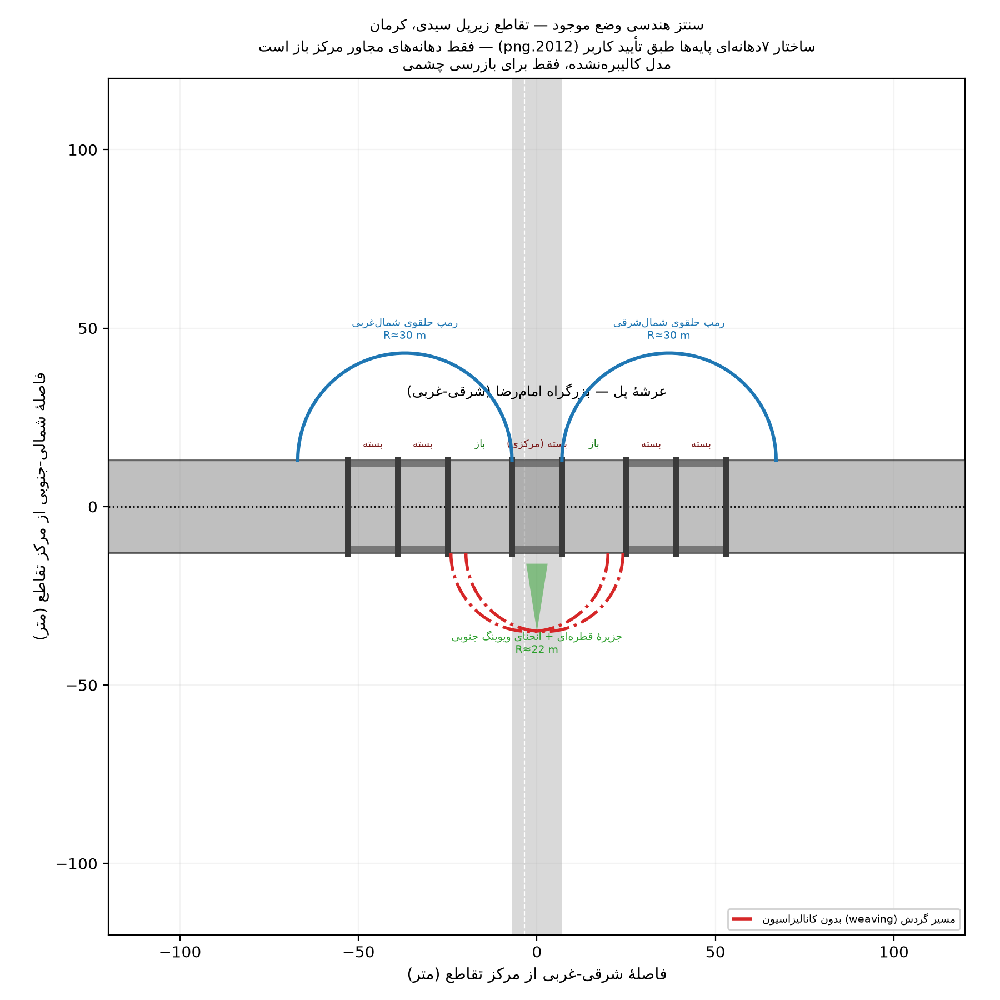
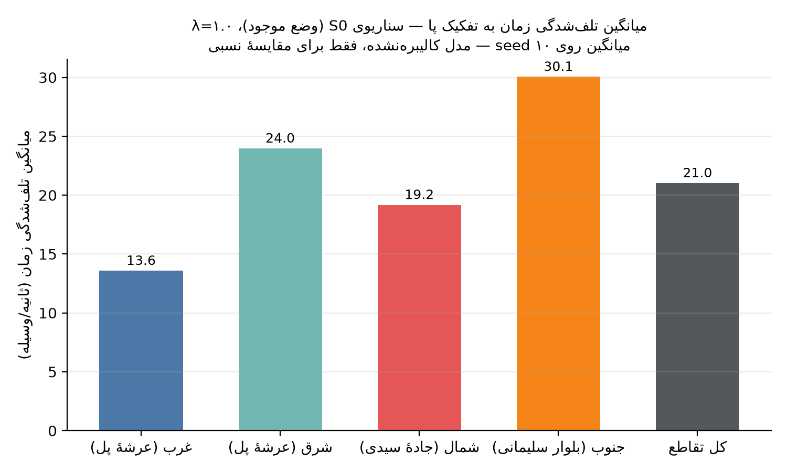

::: {.callout-important}
## هشدار — مدل کالیبره‌نشده
این گزارش نسخهٔ **فاز ۲ (وفاداری هندسی)** است. هندسهٔ پایه هنوز از OSM است (با
اصلاحات مبتنی بر تصویر روی خط عرشه و نوع تقاطع‌های ادغام) و تقاضا کاملاً
**فرضی** (حدس مهندسی، نه برداشت میدانی) باقی مانده است. نتایج این نسخه **صرفاً
برای آزمودن خط لولهٔ تکرارپذیر و وفاداری هندسی** معتبرند، نه برای هیچ نوع
مقایسهٔ سناریویی یا پیش‌بینی مقدار مطلق. مقایسهٔ سناریوها و تحلیل حساسیت در
فازهای ۳ و ۴ (پس از واردکردن تقاضای مبتنی بر شواهد و چند-seed) انجام می‌شود.
:::

## ۱. هدف این نسخه

هدف فاز ۱، طبق نقشهٔ راه پروژه (`CLAUDE.md`)، ساخت یک خط لولهٔ **کامل و
end-to-end** بود — از دادهٔ خام OSM تا گزارش منتشرشده — حتی با هندسه و تقاضای
خام. فاز ۲ (این نسخه) روی همان خط لوله، هندسهٔ حیاتی (خط عرشه، نوع تقاطع‌های
ادغام) و ترکیب ناوگان را به شواهد تصویری/قضاوت مهندسی نزدیک‌تر می‌کند. این
گزارش همچنان صحت فنی و وفاداری هندسی را نشان می‌دهد، نه یافته‌های مهندسی نهایی.

## ۲. ساخت شبکه و راستی‌آزمایی جدایی تراز

شبکه از OpenStreetMap (Overpass API، bbox حول تقاطع زیرپل سیدی) با `netconvert`
ساخته شد. جدایی تراز عرشهٔ پل (بزرگراه امام‌رضا، `bridge=yes layer=1`) از شبکهٔ
هم‌سطح زیرین (جادهٔ سیدی/بلوار شهید سلیمانی) به‌صورت **بصری بررسی و تأیید** شد
(شکل @fig-layer-check) — نقطه‌ای که طبق `CLAUDE.md` مهم‌ترین ریسک خطای مدل است.

{#fig-layer-check width=85%}

## ۳. تقاضا: روش jtrrouter

طبق توجیه روش‌شناسی `CLAUDE.md`، برای یک تقاطع منفرد، حجم ورودی هر پا + نسبت
گردش‌ها روشی به‌مراتب کم‌نیازتر از ماتریس OD کامل است. تقاضای این نسخه کاملاً
فرضی است (رجوع به `config/assumptions.yml` بخش‌های `demand_baseline_phase1` و
`traffic_control.turn_ratio_baseline`):

| پا | حجم ورودی فرضی (وسیله/ساعت) |
|---|---|
| غرب (عرشهٔ پل) | ۸۰۰ |
| شرق (عرشهٔ پل) | ۸۰۰ |
| شمال (جادهٔ سیدی) | ۵۰۰ |
| جنوب (بلوار شهید سلیمانی) | ۵۰۰ |

## ۴. وفاداری هندسی و ترکیب ناوگان (فاز ۲)

**اصلاحات هندسی مبتنی بر تصویر** (اعمال‌شده روی plain-XML با
`src/02_patch_geometry.py`، طبق قاعدهٔ سخت ۲ — بدون هیچ ویرایش دستی netedit):

- **تعداد خط عرشهٔ پل:** OSM آن را ۲ خط در هر جهت ثبت کرده بود؛ بازبینی دقیق‌تر
  `2025_zoom.png` (ردیف‌های سه‌تایی خودرو) با اطمینان بالا ۳ خط را نشان می‌داد
  — اصلاح شد. رجوع به `config/assumptions.yml -> bridge_geometry.deck_lanes_per_direction`.
- **نوع تقاطع نقاط ادغام زیر پل:** ۹ تقاطع ادغام (۲ ورودی/۱ خروجی) در میدانچهٔ
  ویوینگ از `priority` پیش‌فرض netconvert به `zipper` تغییر یافت — برای
  بازنمایی رفتار واقعی «هر که زودتر رسید» در نبود کانالیزاسیون/چراغ (رجوع به
  `traffic_control.weave_merge_junction_model`).

**یافتهٔ کلیدی هندسی — ساختار ۷دهانه‌ای پایه‌های پل:** بازرسی دقیق کاربر از
`2012.png` (زمانی که سازهٔ پل هنوز عریان و پایه‌ها کاملاً قابل‌مشاهده بودند)
نشان داد زیر پل، در امتداد محور شرقی-غربی، به ۷ دهانه تقسیم می‌شود: ۳ دهانه در
غرب + ۱ دهانهٔ مرکزی + ۳ دهانه در شرق (شکل @fig-sketch). از سه دهانهٔ هر سمت،
فقط دهانهٔ **مجاور مرکز** به روی ترافیک باز است و محل واقعی عبور/گردش
خودروهاست؛ دو دهانهٔ انتهایی هر سمت کاملاً بسته و بخشی از بدنهٔ سازه‌ای پل‌اند
(نه فضای خالی قابل‌استفاده)، و دهانهٔ مرکزی در وضع موجود عمداً بسته نگه داشته
شده. این یعنی میدانچهٔ ویوینگ زیر پل، برخلاف تصور اولیهٔ فاز ۰، یک فضای باز
پیوسته نیست — دقیقاً **دو گلوگاه گسسته** (دهانهٔ باز غربی و دهانهٔ باز شرقی) با
یک بستر بستهٔ سازه‌ای میان‌شان است؛ رفتار شبه‌میدانی مشاهده‌شده از وِیوینگ
خودروها بین همین دو گلوگاه ناشی می‌شود. **پیامد سناریو:** باز کردن دهانهٔ
مرکزی (منوط به تأیید ظرفیت باربری سازه توسط مهندس سازه — خارج از محدودهٔ این
مطالعهٔ ترافیکی) یک گزینهٔ صریح برای فاز ۴ است که مسیر سوم عبوری زیر پل را
می‌گشاید. رجوع به `config/assumptions.yml -> bridge_geometry.span_structure`.

{#fig-sketch width=90%}

**ترکیب ناوگان و رفتار** (`config/vtypes.yml`، همه با فلگ `sensitivity: true`
در `assumptions.yml`):

```{python}
#| label: tbl-fleet
#| tbl-cap: "ترکیب ناوگان فرضی (قضاوت مهندسی — اولویت #۱ برنامهٔ کالیبراسیون)"
import yaml
from IPython.display import Markdown
vcfg = yaml.safe_load(open("../config/vtypes.yml", encoding="utf-8"))
names_fa = {"passenger": "سواری", "motorcycle": "موتورسیکلت", "taxi": "تاکسی",
            "pickup": "وانت", "bus": "اتوبوس", "truck_light": "کامیونت"}
rows = [{"دسته": names_fa[k], "سهم": f"{v['share']*100:.0f}٪"} for k, v in vcfg["fleet_composition"].items()]
import pandas as pd
Markdown(pd.DataFrame(rows).to_markdown(index=False))
```

مدل **sublane** با `--lateral-resolution 0.8` فعال شد تا فیلترینگ موتورسیکلت
بین خطوط قابل بازنمایی باشد؛ پارامترهای `tau`, `minGap`, `sigma`,
`impatience`, `jmIgnoreFoeProb`, `lcAssertive` برای همهٔ رده‌ها تهاجمی‌تر از
پیش‌فرض SUMO تنظیم شدند (بیشترین تهاجمی‌بودن برای موتورسیکلت).

::: {.callout-warning}
## یافتهٔ کیفی قابل‌توجه
در همین یک اجرای تک-seed، **۵۶ برخورد** (با `collision.action=warn`، بدون حذف
خودرو) در میدانچهٔ ویوینگ ثبت شد. این عدد **به‌هیچ‌وجه قابل‌گزارش به‌عنوان نرخ
واقعی برخورد نیست** (تک-seed، تقاضا و رفتار فرضی)، اما جهت‌گیری کیفی آن —
تقاطعی با تراکم بالای تعارض در نبود کانالیزاسیون — با مشاهدهٔ میدانی و انگیزهٔ
اصلی این مطالعه همخوان است. شاخص‌های ایمنی جانشین (TTC/DRAC/PET) در فاز ۴ با
چند-seed به‌صورت آماری گزارش می‌شوند.
:::

## ۵. نتیجهٔ اجرا (تک-seed، سناریوی S0)

```{python}
#| label: tbl-kpi
#| tbl-cap: "خلاصهٔ KPI به تفکیک پا — سناریوی S0، تک-seed=۴۲"
import pandas as pd
df = pd.read_csv("../outputs/tables/s0_kpi_summary.csv")
approach_fa = {"west": "غرب (عرشهٔ پل)", "east": "شرق (عرشهٔ پل)",
               "north": "شمال (جادهٔ سیدی)", "south": "جنوب (بلوار سلیمانی)",
               "کل (all)": "کل تقاطع"}
df["approach"] = df["approach"].map(approach_fa)
df.columns = ["پا", "تعداد وسیله", "میانگین مدت سفر (ثانیه)",
              "میانگین تلف‌شدگی زمان (ثانیه)", "میانگین انتظار (ثانیه)",
              "میانگین طول مسیر (متر)"]
from IPython.display import Markdown
Markdown(df.round(2).to_markdown(index=False))
```

{#fig-timeloss width=85%}

هر ۲۶۰۰ وسیلهٔ تولیدشده وارد شبکه شدند و سفر خود را کامل کردند (بدون گم‌شدن یا
گیرافتادن) — نشانهٔ سلامت پایهٔ اتصال شبکه و مسیریابی. مقادیر تلف‌شدگی زمان در
این اجرا پایین‌اند چون تقاضای فرضی فعلی نسبتاً کم است؛ این عدد **هیچ معنای
مهندسی** ندارد تا زمانی که تقاضای واقعی (فاز ۳) جایگزین شود.

## ۶. محدودیت‌های این نسخه

- شعاع گردش رمپ‌ها و موقعیت پایه‌های پل هنوز مستقیماً از OSM/برآورد چشمی‌اند؛
  هیچ اندازه‌گیری میدانی یا تصویر مقیاس‌شدهٔ دقیق پشت آن‌ها نیست.
- تقاضا و نسبت‌های گردش کاملاً فرضی‌اند (فاز ۳ آن‌ها را با شواهد غیرمستقیم
  جایگزین می‌کند).
- سهم ناوگان (به‌ویژه سهم ۳۰٪ موتورسیکلت) قضاوت مهندسی است، نه شمارش — طبق
  برنامهٔ کالیبراسیون (`CLAUDE.md` §۵) بالاترین اولویت برداشت میدانی همین است.
- فقط یک سناریو (S0) و یک seed اجرا شده؛ **هیچ مقایسهٔ سناریویی از این گزارش
  قابل استخراج نیست** — طبق قاعدهٔ سخت ۵ پروژه. عدد ۵۶ برخورد بالا صرفاً یک
  علامت کیفی است، نه نرخ برخورد قابل‌استناد.
- گزارش فارسی اکنون از فونت Vazirmatn با قالب کامل RTL (xepersian) استفاده
  می‌کند؛ پرداخت نهایی چیدمان/سبک بصری در فاز ۵ انجام می‌شود.
